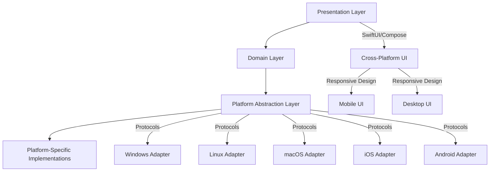

# NetInfinity Cross-Platform Architecture

## Overview

This document provides a comprehensive guide to the NetInfinity cross-platform architecture, which supports Windows, Linux, macOS, Android, and iOS with both desktop and mobile form factors.

## Table of Contents

1. [Architecture Overview](#architecture-overview)
2. [Platform Support Matrix](#platform-support-matrix)
3. [Cross-Platform Core](#cross-platform-core)
4. [Platform-Specific Adapters](#platform-specific-adapters)
5. [Responsive Design System](#responsive-design-system)
6. [Navigation Patterns](#navigation-patterns)
7. [UI Component Architecture](#ui-component-architecture)
8. [Platform Detection](#platform-detection)
9. [Conditional Compilation](#conditional-compilation)
10. [Best Practices](#best-practices)
11. [Future Enhancements](#future-enhancements)

## Architecture Overview

The NetInfinity cross-platform architecture follows a **layered, protocol-oriented design** that separates platform-independent logic from platform-specific implementations.

### Architecture Layers



### Key Principles

- **Protocol-Oriented Design**: All platform-specific functionality is defined through protocols
- **Dependency Injection**: Platform adapters are injected at runtime
- **Responsive Design**: UI adapts to screen size and form factor
- **Feature Detection**: Runtime detection of platform capabilities
- **Conditional Compilation**: Platform-specific code compilation
- **Cross-Platform Consistency**: Unified user experience across platforms

## Platform Support Matrix

### Supported Platforms

| Platform | Desktop | Mobile | Form Factors | Status |
|----------|---------|--------|---------------|--------|
| Windows | ✅ Yes | ❌ No | Desktop, Tablet | ✅ Supported |
| Linux | ✅ Yes | ❌ No | Desktop, Tablet | ✅ Supported |
| macOS | ✅ Yes | ❌ No | Desktop, Laptop | ✅ Supported |
| iOS | ❌ No | ✅ Yes | Phone, Tablet | ✅ Supported |
| Android | ❌ No | ✅ Yes | Phone, Tablet | ✅ Supported |

### Platform Capabilities

| Feature | Windows | Linux | macOS | iOS | Android |
|---------|---------|-------|-------|-----|---------|
| Notifications | ✅ | ✅ | ✅ | ✅ | ✅ |
| Background Sync | ✅ | ✅ | ✅ | ❌ | ❌ |
| File System Access | ✅ | ✅ | ✅ | ❌ | ❌ |
| Camera Access | ✅ | ✅ | ✅ | ✅ | ✅ |
| Microphone Access | ✅ | ✅ | ✅ | ✅ | ✅ |
| Location Services | ✅ | ✅ | ✅ | ✅ | ✅ |
| Biometric Authentication | ✅ | ✅ | ✅ | ✅ | ✅ |
| Multi-Window | ✅ | ✅ | ✅ | ❌ | ❌ |
| System Tray | ✅ | ✅ | ✅ | ❌ | ❌ |
| Push Notifications | ❌ | ❌ | ❌ | ✅ | ✅ |
| Widgets | ❌ | ❌ | ❌ | ✅ | ✅ |
| Share Extension | ❌ | ❌ | ❌ | ✅ | ✅ |
| App Clips | ❌ | ❌ | ❌ | ✅ | ❌ |
| Instant Apps | ❌ | ❌ | ❌ | ❌ | ✅ |

## Cross-Platform Core

### Platform Detection

The `PlatformDetector` class provides comprehensive platform detection:

```swift
public enum Platform {
    case windows
    case linux
    case macOS
    case iOS
    case android
    case unknown(String)
}

public struct PlatformDetector {
    public static var currentPlatform: Platform
    public static var currentDeviceFormFactor: DeviceFormFactor
    public static var isMobilePlatform: Bool
    public static var isDesktopPlatform: Bool
    public static var isTouchInterface: Bool
    public static var supportsWindowManagement: Bool
}
```

### Platform Capabilities

```swift
public struct PlatformCapabilities {
    public static func supportsFeature(_ feature: PlatformFeature) -> Bool
}

public enum PlatformFeature {
    case notifications
    case backgroundSync
    case fileSystemAccess
    case cameraAccess
    case microphoneAccess
    case locationServices
    case biometricAuthentication
    case multiWindow
    case systemTray
    case pushNotifications
    case widgets
    case shareExtension
    case appClips
    case instantApps
}
```

### Platform Adapter Protocol

```swift
public protocol PlatformAdapterProtocol {
    // Platform Information
    var platformName: String { get }
    var platformVersion: String { get }
    var deviceModel: String { get }
    
    // File System
    func getDocumentsDirectory() -> URL
    func getCacheDirectory() -> URL
    func getAppSupportDirectory() -> URL
    
    // Notifications
    func showNotification(title: String, message: String)
    func scheduleNotification(title: String, message: String, delay: TimeInterval)
    
    // System Integration
    func openURL(_ url: URL)
    func openFile(_ url: URL)
    func shareContent(_ content: [Any], completion: ((Bool) -> Void)?)
    
    // App Lifecycle
    func registerForAppLifecycleEvents()
    func handleAppWillTerminate()
    
    // Window Management
    func createWindow(title: String, size: CGSize) -> WindowReference
    func showWindow(_ window: WindowReference)
    func hideWindow(_ window: WindowReference)
    func closeWindow(_ window: WindowReference)
    
    // System Dialogs
    func showAlert(title: String, message: String, completion: (() -> Void)?)
    func showConfirm(title: String, message: String, completion: ((Bool) -> Void)?)
    func showFilePicker(allowMultiple: Bool, completion: (([URL]?) -> Void)?)
}
```

### Platform Adapter Factory

```swift
public struct PlatformAdapterFactory {
    public static func createAdapter() -> PlatformAdapterProtocol
    public static func createNotificationService() -> NotificationServiceProtocol
    public static func createDeepLinkHandler(navigationManager: NavigationManager) -> DeepLinkServiceProtocol
}
```

## Platform-Specific Adapters

### Windows Adapter

- **Platform Detection**: Windows-specific platform identification
- **Notifications**: Windows Toast notifications
- **File System**: Windows file system integration
- **Window Management**: Windows window creation and management
- **System Integration**: Windows-specific system features

### Linux Adapter

- **Platform Detection**: Linux distribution detection
- **Notifications**: Freedesktop notifications
- **File System**: Linux file system integration
- **Window Management**: X11/Wayland window management
- **System Integration**: Linux desktop integration

### macOS Adapter

- **Platform Detection**: macOS version detection
- **Notifications**: NSUserNotificationCenter integration
- **File System**: macOS file system integration
- **Window Management**: NSWindow-based window management
- **System Integration**: macOS menu bar and dock integration

### iOS Adapter

- **Platform Detection**: iOS device and version detection
- **Notifications**: UNUserNotificationCenter integration
- **File System**: iOS sandboxed file system
- **Window Management**: UIViewController-based navigation
- **System Integration**: iOS-specific features (App Clips, Widgets)

### Android Adapter

- **Platform Detection**: Android device and version detection
- **Notifications**: Firebase Cloud Messaging integration
- **File System**: Android storage system
- **Window Management**: Activity-based navigation
- **System Integration**: Android-specific features (Instant Apps, Intents)

## Responsive Design System

### Breakpoints and Screen Sizes

```swift
public enum Breakpoint: CGFloat {
    case xSmall = 320    // Mobile phones (portrait)
    case small = 480     // Mobile phones (landscape)
    case medium = 768    // Tablets (portrait)
    case large = 1024    // Tablets (landscape)/Small desktops
    case xLarge = 1280   // Desktops
    case xxLarge = 1440  // Large desktops
    case xxxLarge = 1920 // Extra large desktops
}

public enum ScreenSize {
    case mobile
    case tablet
    case desktop
    case largeDesktop
}
```

### Responsive Utilities

```swift
public struct ResponsiveDesign {
    public static var currentScreenSize: ScreenSize
    public static var currentScreenWidth: CGFloat
    public static var currentScreenHeight: CGFloat
    public static var currentOrientation: DeviceOrientation
    
    public static func responsiveValue<T: Numeric & Comparable>(
        mobile: T,
        tablet: T,
        desktop: T,
        largeDesktop: T? = nil
    ) -> T
    
    public static func responsiveFont(
        mobile: Font,
        tablet: Font,
        desktop: Font,
        largeDesktop: Font? = nil
    ) -> Font
}
```

### Responsive Components

```swift
// Responsive Stacks
public struct ResponsiveHStack<Content: View>: View
public struct ResponsiveVStack<Content: View>: View

// Responsive Grid
public struct ResponsiveGrid<Content: View, Item: Identifiable>: View

// Responsive Modifier
public struct ResponsiveModifier: ViewModifier
```

### Layout Configurations

```swift
public protocol LayoutConfig {
    var columnCount: Int { get }
    var itemSize: CGSize { get }
    var spacing: CGFloat { get }
    var padding: CGFloat { get }
    var cornerRadius: CGFloat { get }
    var maxWidth: CGFloat? { get }
}

// Mobile, Tablet, Desktop, LargeDesktop configurations
```

### Navigation Configurations

```swift
public protocol NavigationConfig {
    var navigationStyle: NavigationStyle { get }
    var sidebarWidth: CGFloat { get }
    var sidebarVisible: Bool { get }
    var toolbarVisible: Bool { get }
    var usesTabs: Bool { get }
}

public enum NavigationStyle {
    case stack
    case splitView
    case sidebar
    case tabbed
    case modal
}
```

## Navigation Patterns

### Cross-Platform Navigation

```swift
// NavigationManager with platform-aware navigation
public class NavigationManager: ObservableObject {
    @Published var path = NavigationPath()
    @Published var presentedSheet: NavigationDestination?
    @Published var fullScreenCover: NavigationDestination?
    
    private let platformAdapter: PlatformAdapterProtocol
    
    public init(platformAdapter: PlatformAdapterProtocol = PlatformAdapterFactory.createAdapter()) {
        self.platformAdapter = platformAdapter
    }
}
```

### Platform-Specific Navigation

```swift
// Mobile Navigation (Stack-based)
public struct MobileNavigationConfig: NavigationConfig {
    public let navigationStyle: NavigationStyle = .stack
    public let sidebarWidth: CGFloat = 280
    public let sidebarVisible: Bool = false
    public let toolbarVisible: Bool = true
    public let usesTabs: Bool = false
}

// Desktop Navigation (Sidebar-based)
public struct DesktopNavigationConfig: NavigationConfig {
    public let navigationStyle: NavigationStyle = .sidebar
    public let sidebarWidth: CGFloat = 240
    public let sidebarVisible: Bool = true
    public let toolbarVisible: Bool = true
    public let usesTabs: Bool = true
}
```

## UI Component Architecture

### Cross-Platform Components

```swift
// Common UI Components
public struct PrimaryButton: View
public struct SecondaryButton: View
public struct TextButton: View
public struct IconButton: View
public struct CompoundCard: View
public struct CompoundTextField: View
public struct CompoundAvatar: View
```

### Platform-Specific Components

```swift
// Mobile-specific components
public struct MobileRoomListView: View
public struct MobileRoomView: View
public struct MobileNavigationBar: View

// Desktop-specific components
public struct DesktopRoomListView: View
public struct DesktopRoomView: View
public struct DesktopSidebar: View
public struct DesktopToolbar: View
```

### Responsive Components

```swift
// Responsive components that adapt to screen size
public struct ResponsiveRoomView: View {
    public var body: some View {
        if ResponsiveDesign.currentScreenSize == .mobile {
            MobileRoomView()
        } else {
            DesktopRoomView()
        }
    }
}
```

## Platform Detection

### Runtime Detection

```swift
// Detect platform at runtime
let platform = PlatformDetector.currentPlatform
let isMobile = PlatformDetector.isMobilePlatform
let isDesktop = PlatformDetector.isDesktopPlatform
let isTouch = PlatformDetector.isTouchInterface
```

### Feature Detection

```swift
// Check for platform features
let supportsMultiWindow = PlatformCapabilities.supportsFeature(.multiWindow)
let supportsBackgroundSync = PlatformCapabilities.supportsFeature(.backgroundSync)
let supportsPushNotifications = PlatformCapabilities.supportsFeature(.pushNotifications)
```

### Device Form Factor Detection

```swift
// Detect device form factor
let formFactor = PlatformDetector.currentDeviceFormFactor
let screenSize = ResponsiveDesign.currentScreenSize
let orientation = ResponsiveDesign.currentOrientation
```

## Conditional Compilation

### Platform-Specific Code

```swift
// Compile different code for different platforms
#if os(Windows)
// Windows-specific implementation
#elif os(Linux)
// Linux-specific implementation
#elif os(macOS)
// macOS-specific implementation
#elif os(iOS)
// iOS-specific implementation
#elif os(Android)
// Android-specific implementation
#else
// Fallback implementation
#endif
```

### Platform Compiler Flags

```swift
public struct PlatformCompilerFlags {
    public static var isWindows: Bool
    public static var isLinux: Bool
    public static var isMacOS: Bool
    public static var isIOS: Bool
    public static var isAndroid: Bool
    public static var isMobile: Bool
    public static var isDesktop: Bool
}
```

## Best Practices

### Cross-Platform Development

1. **Protocol-Oriented Design**: Always define protocols before implementations
2. **Dependency Injection**: Inject platform adapters rather than creating them internally
3. **Feature Detection**: Use runtime feature detection for platform capabilities
4. **Responsive Design**: Design UI to adapt to different screen sizes
5. **Conditional Compilation**: Use compiler flags for platform-specific code
6. **Error Handling**: Comprehensive error handling for platform-specific failures
7. **Testing**: Test on all target platforms

### Platform-Specific Considerations

1. **Windows**: Handle different Windows versions and editions
2. **Linux**: Support multiple desktop environments (GNOME, KDE, etc.)
3. **macOS**: Follow Apple Human Interface Guidelines
4. **iOS**: Follow iOS Human Interface Guidelines
5. **Android**: Follow Material Design guidelines

### Performance Optimization

1. **Memory Management**: Be mindful of memory usage on mobile platforms
2. **Background Processing**: Use appropriate background processing for each platform
3. **Network Usage**: Optimize network usage for mobile platforms
4. **Battery Life**: Optimize for battery life on mobile platforms
5. **Startup Time**: Optimize startup time on all platforms

## Future Enhancements

### Platform Support

1. **WebAssembly**: Add WebAssembly support for browser-based access
2. **tvOS**: Add Apple TV support
3. **watchOS**: Add Apple Watch support
4. **Wear OS**: Add Android Wear support
5. **CarPlay**: Add CarPlay support
6. **Android Auto**: Add Android Auto support

### Feature Enhancements

1. **Advanced Analytics**: Cross-platform analytics and telemetry
2. **Performance Monitoring**: Comprehensive performance monitoring
3. **A/B Testing**: Cross-platform A/B testing framework
4. **Feature Flags**: Dynamic feature flag system
5. **Advanced Caching**: Improved cross-platform caching
6. **Offline Support**: Enhanced offline capabilities
7. **Cross-Platform Sync**: Better sync between platforms

### UI Enhancements

1. **Dark Mode**: Consistent dark mode across platforms
2. **Dynamic Themes**: User-customizable themes
3. **Accessibility**: Enhanced accessibility features
4. **Internationalization**: Improved multi-language support
5. **Animation**: Consistent animations across platforms
6. **Haptic Feedback**: Platform-appropriate haptic feedback

## Conclusion

The NetInfinity cross-platform architecture provides a robust foundation for building applications that work seamlessly across Windows, Linux, macOS, Android, and iOS. By leveraging protocol-oriented design, dependency injection, and responsive design principles, the architecture ensures:

- **Cross-Platform Consistency**: Unified user experience across all platforms
- **Native Performance**: Platform-optimized performance
- **Code Reusability**: Maximum code sharing between platforms
- **Maintainability**: Clear separation of concerns
- **Extensibility**: Easy to add new platforms and features
- **Future-Proof**: Designed for long-term evolution

This architecture enables NetInfinity to deliver a consistent, high-quality experience to users regardless of their chosen platform or device form factor.