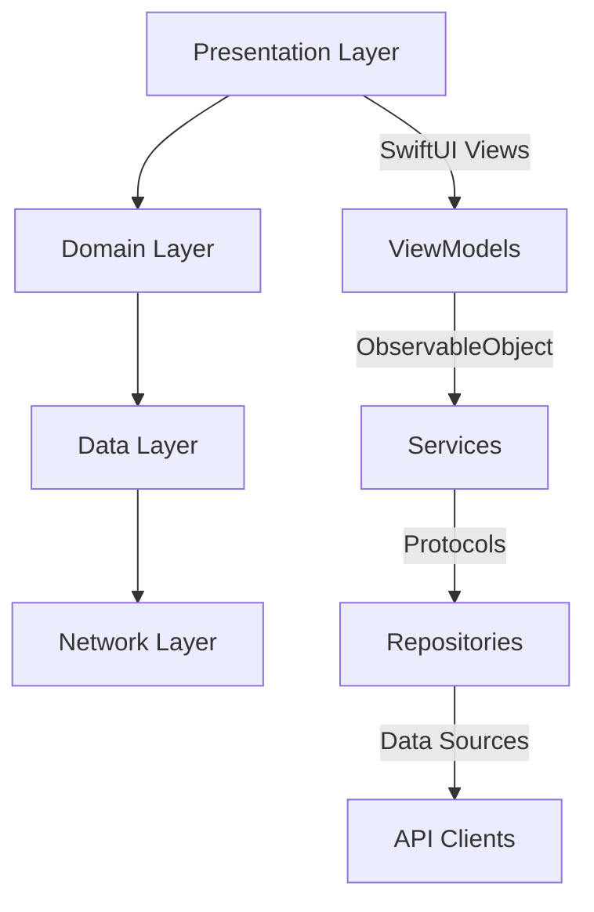

# NetInfinity Swift UI Architecture

## Overview

This document provides a comprehensive guide to the Swift UI architecture for NetInfinity, which adapts the Android RootFlowNode architecture to native SwiftUI patterns while maintaining cross-platform consistency.

## Table of Contents

1. [Architecture Overview](#architecture-overview)
2. [Navigation System](#navigation-system)
3. [Authentication Flow](#authentication-flow)
4. [Room Navigation](#room-navigation)
5. [Media System](#media-system)
6. [Push Notifications](#push-notifications)
7. [Deep Linking](#deep-linking)
8. [Design System](#design-system)
9. [Accessibility](#accessibility)
10. [Internationalization](#internationalization)
11. [Testing](#testing)
12. [Best Practices](#best-practices)

## Architecture Overview

The NetInfinity Swift UI architecture follows a **protocol-oriented, reactive design** that leverages modern SwiftUI capabilities while maintaining architectural patterns from the Android implementation.

### Key Principles

- **Protocol-Oriented Design**: All services follow protocol interfaces for testability
- **Reactive Programming**: Uses Combine framework for data flow
- **State Management**: Leverages SwiftUI's native state management with `@Published` and `ObservableObject`
- **Cross-Platform Consistency**: Maintains navigation patterns from Android RootFlowNode
- **Native Performance**: Uses native SwiftUI components for optimal performance

### Architecture Layers



## Navigation System

### NavigationManager

The core navigation system is implemented in `NavigationManager`, which adapts Android's RootFlowNode architecture to SwiftUI's navigation patterns.

#### Key Features

- **NavigationPath**: Uses SwiftUI's `NavigationPath` for stack-based navigation
- **Sheet Navigation**: Modal presentation with `presentedSheet`
- **Full Screen Covers**: Full-screen modal presentation with `fullScreenCover`
- **Deep Linking**: Integrated deep link handling
- **Intent Handling**: Cross-platform intent processing

#### Navigation Destinations

```swift
enum NavigationDestination: Hashable {
    case splashScreen
    case login
    case home
    case room(roomId: String)
    case roomDetails(roomId: String)
    case userProfile(userId: String)
    case settings
    case mediaViewer(mediaId: String)
    case search
    case createRoom
    case notifications
    case call(callId: String)
    case roomInvite(roomId: String)
    case onboarding
    case createAccount
    case forgotPassword
    case accountSelect(currentSessionId: String, intent: Intent?, permalinkData: PermalinkData?)
    case signedOutFlow(sessionId: String)
    case bugReport
    case deepLink(url: URL)
}
```

#### RootFlowNode Methods

| Android Method | Swift Equivalent | Description |
|---------------|------------------|-------------|
| `switchToLoggedInFlow()` | `switchToLoggedInFlow(sessionId:navId:)` | Navigate to logged-in state |
| `switchToNotLoggedInFlow()` | `switchToNotLoggedInFlow(params:)` | Navigate to login flow |
| `switchToSignedOutFlow()` | `switchToSignedOutFlow(sessionId:)` | Navigate to signed-out state |
| `navigateToAccountSelect()` | `navigateToAccountSelect(currentSessionId:intent:permalinkData:)` | Show account selection |
| `handleIntent()` | `handleIntent(_:)` | Process intents/URLs |
| `navigateTo(permalinkData:)` | `navigateTo(permalinkData:)` | Handle permalinks |
| `navigateTo(deeplinkData:)` | `navigateTo(deeplinkData:)` | Handle deep links |

### Usage Examples

```swift
// Basic navigation
navigationManager.navigateToRoom("room123")

// Authentication flow
navigationManager.switchToLoggedInFlow(sessionId: "session123", navId: 1)

// Deep linking
navigationManager.handleDeepLink(URL(string: "netinfinity://room/room123")!)

// Intent handling
let intent = Intent(url: URL(string: "https://netinfinity.local/invite")!)
navigationManager.handleIntent(intent)
```

## Authentication Flow

### AuthenticationService

The authentication service handles all authentication-related operations with a protocol-oriented design.

#### Authentication States

```swift
enum AuthenticationState {
    case unknown
    case authenticated(session: Session)
    case notAuthenticated
    case onboardingRequired
    case sessionExpired
}
```

#### Authentication Methods

```swift
protocol AuthenticationServiceProtocol {
    var authenticationState: CurrentValueSubject<AuthenticationState, Never> { get }
    
    func login(email: String, password: String) async throws -> Session
    func loginWithSSO(provider: SSOProvider, token: String) async throws -> Session
    func register(email: String, password: String, username: String) async throws -> Session
    func restoreSession() async throws -> Session
    func logout() async throws
    func checkSessionValidity() async -> Bool
    func handleOAuthCallback(url: URL) async throws -> Session
}
```

### Authentication Views

- **LoginView**: Email/password and SSO login
- **OnboardingView**: Multi-step onboarding process
- **CreateAccountView**: User registration
- **ForgotPasswordView**: Password recovery

## Room Navigation

### RoomService

Handles all room-related operations:

```swift
protocol RoomServiceProtocol {
    // Room management
    func getRooms() async throws -> [Room]
    func getRoom(roomId: String) async throws -> Room
    func createRoom(name: String, topic: String?, isPublic: Bool) async throws -> Room
    func joinRoom(roomId: String) async throws -> Room
    func leaveRoom(roomId: String) async throws
    func updateRoom(roomId: String, name: String?, topic: String?, avatarUrl: String?) async throws -> Room
    
    // Room members
    func getRoomMembers(roomId: String) async throws -> [RoomMember]
    func inviteUsers(roomId: String, userIds: [String]) async throws
    func kickUser(roomId: String, userId: String) async throws
    func banUser(roomId: String, userId: String) async throws
    
    // Messaging
    func getMessages(roomId: String, limit: Int, from: String?) async throws -> [Message]
    func sendMessage(roomId: String, content: MessageContent) async throws -> Message
    func uploadFile(roomId: String, fileData: Data, filename: String, mimeType: String) async throws -> Message
    
    // Room events
    func getRoomEvents(roomId: String, limit: Int, from: String?) async throws -> [RoomEvent]
    
    // Search
    func searchRooms(query: String, limit: Int) async throws -> [Room]
}
```

### Room Views

- **RoomListView**: Categorized room list with favorites, DMs, and regular rooms
- **RoomView**: Complete room interface with header, timeline, and composer
- **MessageBubbleView**: Rich message rendering for all content types
- **MessageComposerView**: Advanced message input with attachments

## Media System

### Media Components

- **MediaViewerView**: Full-screen media viewer with zoom, pan, and controls
- **MediaGalleryView**: Grid-based media gallery with preview
- **MediaItem**: Comprehensive media model supporting images, videos, audio, and documents

### Media Features

- **Zoom and Pan**: Gesture-based image zooming and panning
- **Media Types**: Support for images, videos, audio, and documents
- **Caption Support**: Media captions and descriptions
- **Controls**: Share, save, favorite, and more actions
- **Accessibility**: Full VoiceOver support for media content

## Push Notifications

### NotificationService

Comprehensive notification handling:

```swift
protocol NotificationServiceProtocol {
    var notificationReceived: PassthroughSubject<NotificationData, Never> { get }
    
    func requestPermission() async -> Bool
    func registerForRemoteNotifications() async
    func handleRemoteNotification(userInfo: [AnyHashable: Any])
    func scheduleLocalNotification(title: String, body: String, userInfo: [AnyHashable: Any]?)
    func clearAllNotifications()
    func processNotificationResponse(userInfo: [AnyHashable: Any]) -> NotificationAction?
}
```

### Notification Types

```swift
enum NotificationType {
    case message
    case invite
    case reaction
    case mention
    case call
    case system
    case unknown
}
```

## Deep Linking

### DeepLinkService

Handles all deep link and universal link processing:

```swift
protocol DeepLinkServiceProtocol {
    var deepLinkReceived: PassthroughSubject<DeepLinkData, Never> { get }
    
    func handleDeepLink(url: URL) -> Bool
    func handleUniversalLink(url: URL) -> Bool
    func processDeepLinkData(_ data: DeepLinkData)
}
```

### Deep Link Patterns

- `netinfinity://room/{roomId}` - Navigate to room
- `netinfinity://call/{callId}` - Navigate to call
- `netinfinity://user/{userId}` - Navigate to user profile
- `netinfinity://settings` - Navigate to settings
- `netinfinity://login` - Navigate to login
- `netinfinity://invite?room_id={roomId}` - Handle room invite

## Design System

### CompoundDesignSystem

A comprehensive design system inspired by Compound with Material Design 3 principles:

#### Color System

```swift
struct Colors {
    static let primary = Color("PrimaryColor", bundle: .main)
    static let secondary = Color("SecondaryColor", bundle: .main)
    static let surface = Color("Surface", bundle: .main)
    static let background = Color("Background", bundle: .main)
    static let error = Color("Error", bundle: .main)
    // ... and more
}
```

#### Typography

```swift
struct Typography {
    static func displayLarge() -> Font
    static func headlineMedium() -> Font
    static func bodyMedium() -> Font
    static func labelSmall() -> Font
    // ... comprehensive typography scale
}
```

#### Components

- **PrimaryButton**: Main action buttons
- **SecondaryButton**: Secondary action buttons
- **TextButton**: Text-based buttons
- **IconButton**: Icon-only buttons
- **CompoundCard**: Card components with elevation
- **CompoundTextField**: Form input fields
- **CompoundAvatar**: User avatar components

## Accessibility

### AccessibilityUtils

Comprehensive accessibility support:

```swift
struct AccessibilityUtils {
    static func announce(_ message: String)
    static func accessibilityLabel(for text: String, context: String?) -> String
    static func isBoldTextEnabled() -> Bool
    static func isReduceMotionEnabled() -> Bool
    // ... and more
}
```

### Accessibility Features

- **Screen Reader Support**: Full VoiceOver compatibility
- **Dynamic Type**: Support for all text sizes
- **Reduce Motion**: Respects user motion preferences
- **Bold Text**: Adapts to bold text settings
- **High Contrast**: Supports increased contrast modes
- **Accessibility Actions**: Custom actions for complex components

## Internationalization

### InternationalizationUtils

Multi-language support:

```swift
struct InternationalizationUtils {
    static func currentLanguage() -> String
    static func isRTLLanguage() -> Bool
    static func localizedString(_ key: String, bundle: Bundle, comment: String) -> String
    static func localizedDateString(_ date: Date, style: DateFormatter.Style) -> String
    // ... and more
}
```

### Localization Features

- **String Localization**: Full localization support
- **Date/Time Formatting**: Locale-aware date formatting
- **Number Formatting**: Locale-aware number formatting
- **RTL Support**: Right-to-left language support
- **Pluralization**: Proper pluralization rules

## Testing

### Testing Infrastructure

- **Unit Tests**: Comprehensive unit testing for services
- **UI Tests**: UI testing for views and navigation
- **Test Coverage**: High test coverage for critical paths

### Test Examples

```swift
// Navigation Manager Tests
func testNavigateToRoom() {
    let expectation = XCTestExpectation(description: "Should navigate to room")
    
    navigationManager.$path
        .sink { path in
            if path.count == 1, case .room = path.last {
                expectation.fulfill()
            }
        }
        .store(in: &cancellables)
    
    navigationManager.navigateToRoom("test-room")
    
    wait(for: [expectation], timeout: 1.0)
}
```

## Best Practices

### SwiftUI Best Practices

1. **State Management**: Use `@State`, `@Binding`, and `@ObservedObject` appropriately
2. **View Composition**: Break down complex views into smaller, reusable components
3. **Performance**: Use `LazyVStack` and `LazyHStack` for large lists
4. **Accessibility**: Always include accessibility modifiers
5. **Localization**: Use `NSLocalizedString` for all user-facing text

### Architecture Best Practices

1. **Protocol-Oriented Design**: Always define protocols before implementations
2. **Dependency Injection**: Inject dependencies rather than creating them internally
3. **Reactive Programming**: Use Combine for data flow and state management
4. **Error Handling**: Comprehensive error handling with user-friendly messages
5. **Testing**: Write tests for all critical functionality

### Cross-Platform Consistency

1. **Navigation Patterns**: Maintain consistent navigation across platforms
2. **Authentication Flow**: Keep authentication experience similar
3. **Room Experience**: Ensure room navigation and messaging is consistent
4. **Design Language**: Use the same design system across platforms
5. **Accessibility**: Maintain consistent accessibility standards

## Migration Guide

### From Android to SwiftUI

1. **Navigation**: Replace `RootFlowNode` with `NavigationManager`
2. **Views**: Convert XML layouts to SwiftUI views
3. **Services**: Implement protocol-oriented services
4. **State Management**: Use SwiftUI's native state management
5. **Testing**: Adapt tests to XCTest framework

### Key Differences

| Android Concept | SwiftUI Equivalent |
|----------------|-------------------|
| `RootFlowNode` | `NavigationManager` |
| `NavTarget` | `NavigationDestination` |
| `Intent` | `Intent` struct |
| `PermalinkData` | `PermalinkData` enum |
| `DeeplinkData` | `DeeplinkData` enum |
| Activities | SwiftUI Views |
| Fragments | SwiftUI Views |
| ViewModel | `ObservableObject` |
| LiveData | `@Published` properties |
| Jetpack Compose | SwiftUI |

## Future Enhancements

1. **Advanced Analytics**: Enhanced navigation tracking and user behavior analysis
2. **Performance Monitoring**: Comprehensive performance monitoring
3. **A/B Testing**: Framework for A/B testing UI components
4. **Feature Flags**: Dynamic feature flag system
5. **Advanced Caching**: Improved caching strategies
6. **Offline Support**: Enhanced offline capabilities
7. **Cross-Platform Sync**: Better sync between iOS and Android
8. **Widget Support**: Home screen widgets
9. **WatchOS Integration**: Apple Watch companion app
10. **Mac Catalyst**: Desktop-class experience on Mac

## Conclusion

The NetInfinity Swift UI architecture provides a robust, performant, and maintainable foundation for the iOS application. By adapting the proven Android RootFlowNode architecture to native SwiftUI patterns, we achieve cross-platform consistency while leveraging the full power of Apple's native frameworks.

This architecture ensures:
- **Consistent user experience** across platforms
- **High performance** through native components
- **Maintainable codebase** with clear separation of concerns
- **Comprehensive testing** for reliability
- **Accessibility and internationalization** for global reach
- **Future extensibility** for new features and platforms
