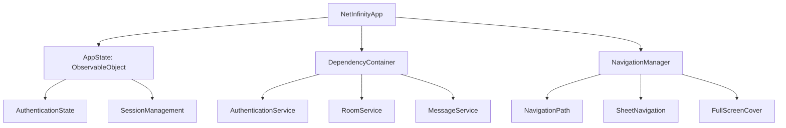

# SeasonCom Technical Specification

## Swift iOS UI Implementation

The NetInfinity iOS application is built using SwiftUI with a modern MVVM architecture, following the patterns established in the Android mobile UI while leveraging native iOS technologies.

### Architecture Overview



### Main Application Entry Point

```swift
// NetInfinityApp.swift
@main
struct NetInfinityApp: App {
    @StateObject private var appState = AppState()
    @StateObject private var dependencyContainer = AppDependencyContainer()
    
    var body: some Scene {
        WindowGroup {
            RootView()
                .environmentObject(appState)
                .environmentObject(dependencyContainer)
                .preferredColorScheme(appState.colorScheme)
        }
    }
}
```

### State Management System

```swift
// AppState.swift
final class AppState: ObservableObject {
    @Published var authenticationState: AuthenticationState = .unknown
    @Published var currentSession: Session?
    @Published var colorScheme: ColorScheme = .light
    @Published var isLoading = false
    @Published var error: AppError?
    
    enum AuthenticationState {
        case unknown, authenticated, notAuthenticated
    }
}
```

### Dependency Injection Framework

```swift
// DependencyContainer.swift
protocol DependencyContainer {
    var authenticationService: AuthenticationService { get }
    var roomService: RoomService { get }
    var messageService: MessageService { get }
    var userService: UserService { get }
    var mediaService: MediaService { get }
    var notificationService: NotificationService { get }
    var analyticsService: AnalyticsService { get }
}

final class AppDependencyContainer: DependencyContainer {
    let authenticationService: AuthenticationService
    let roomService: RoomService
    let messageService: MessageService
    let userService: UserService
    let mediaService: MediaService
    let notificationService: NotificationService
    let analyticsService: AnalyticsService
    
    init() {
        let networkService = DefaultNetworkService()
        let storageService = DefaultStorageService()
        
        self.authenticationService = DefaultAuthenticationService(
            networkService: networkService,
            storageService: storageService
        )
        
        self.roomService = DefaultRoomService(
            networkService: networkService,
            storageService: storageService
        )
        
        // Other services initialized similarly
    }
}
```

### Navigation System

```swift
// NavigationManager.swift
enum NavigationDestination: Hashable {
    case login
    case home
    case room(roomId: String)
    case roomDetails(roomId: String)
    case userProfile(userId: String)
    case settings
    case mediaViewer(mediaId: String)
    case search
    case createRoom
    case notifications
}

final class NavigationManager: ObservableObject {
    @Published var path = NavigationPath()
    @Published var presentedSheet: NavigationDestination?
    @Published var fullScreenCover: NavigationDestination?
    
    func navigate(to destination: NavigationDestination) {
        path.append(destination)
    }
    
    func navigateBack() {
        guard !path.isEmpty else { return }
        path.removeLast()
    }
    
    func navigateToRoot() {
        path = NavigationPath()
    }
}
```

### Root Navigation Flow

```swift
// RootView.swift
struct RootView: View {
    @EnvironmentObject var appState: AppState
    @EnvironmentObject var navigationManager: NavigationManager
    
    var body: some View {
        Group {
            switch appState.authenticationState {
            case .unknown:
                SplashScreenView()
                    .onAppear {
                        checkAuthenticationState()
                    }
            case .authenticated:
                MainTabView()
                    .environmentObject(navigationManager)
            case .notAuthenticated:
                AuthenticationView()
                    .environmentObject(navigationManager)
            }
        }
        .withSheetNavigation()
        .withFullScreenCoverNavigation()
    }
}
```

### Main UI Components

**Room List View**
```swift
struct RoomListView: View {
    @StateObject private var viewModel = RoomListViewModel()
    @EnvironmentObject var navigationManager: NavigationManager
    
    var body: some View {
        List(viewModel.rooms) { room in
            RoomRowView(room: room)
                .onTapGesture {
                    navigationManager.navigate(to: .room(roomId: room.id))
                }
        }
        .refreshable {
            await viewModel.loadRooms()
        }
    }
}
```

**Message Composer**
```swift
struct MessageComposerView: View {
    @State private var messageText = ""
    @State private var isAttachmentSheetPresented = false
    
    let onSendMessage: (String) -> Void
    let onAttachment: () -> Void
    
    var body: some View {
        HStack {
            TextField("Type a message...", text: $messageText)
                .textFieldStyle(PlainTextFieldStyle())
                .padding(.horizontal, 12)
                .background(Color(.systemGray6))
                .cornerRadius(20)
            
            Button(action: {
                if !messageText.isEmpty {
                    onSendMessage(messageText)
                    messageText = ""
                } else {
                    isAttachmentSheetPresented = true
                }
            }) {
                Image(systemName: messageText.isEmpty ? "plus.circle.fill" : "paperplane.fill")
                    .font(.title2)
            }
            .foregroundColor(.blue)
        }
        .padding()
        .sheet(isPresented: $isAttachmentSheetPresented) {
            AttachmentPickerView(onSelect: onAttachment)
        }
    }
}
```

### ViewModel Architecture

```swift
final class RoomListViewModel: ObservableObject {
    @Published var rooms: [Room] = []
    @Published var isLoading = false
    
    private let roomService: RoomService
    
    init(roomService: RoomService = ServiceLocator.shared.roomService) {
        self.roomService = roomService
    }
    
    @MainActor
    func loadRooms() async {
        isLoading = true
        defer { isLoading = false }
        
        do {
            rooms = try await roomService.getRooms()
        } catch {
            // Handle error
        }
    }
}
```

### Error Handling System

```swift
enum AppError: Error, Identifiable {
    case authenticationFailed
    case networkError(Error)
    case invalidSession
    case unknownError
    
    var id: String {
        switch self {
        case .authenticationFailed: return "authenticationFailed"
        case .networkError: return "networkError"
        case .invalidSession: return "invalidSession"
        case .unknownError: return "unknownError"
        }
    }
    
    var title: String {
        switch self {
        case .authenticationFailed: return "Authentication Failed"
        case .networkError: return "Network Error"
        case .invalidSession: return "Invalid Session"
        case .unknownError: return "Error"
        }
    }
    
    var message: String {
        switch self {
        case .authenticationFailed: return "Failed to authenticate. Please try again."
        case .networkError(let error): return "Network error: \(error.localizedDescription)"
        case .invalidSession: return "Your session has expired. Please log in again."
        case .unknownError: return "An unknown error occurred. Please try again."
        }
    }
}
```

### Performance Considerations

- **State Management**: Uses `@Published` properties with Combine framework for reactive updates
- **Navigation**: Implements SwiftUI's `NavigationPath` for efficient state-based navigation
- **Memory**: Uses `@StateObject` for proper view model lifecycle management
- **Concurrency**: Leverages `async/await` for all network operations
- **UI Updates**: Implements lazy loading and pagination for large datasets

### Security Considerations

- **Data Protection**: Uses Keychain for secure credential storage
- **Network Security**: Implements TLS pinning for all network requests
- **Authentication**: Uses biometric authentication for sensitive operations
- **Session Management**: Implements secure session persistence with encryption

### Testing Strategy

- **Unit Tests**: Comprehensive testing for view models and services
- **UI Tests**: Integration tests for critical user flows
- **Snapshot Tests**: Visual regression testing for UI components
- **Performance Tests**: Memory and CPU usage monitoring

### Internationalization and Accessibility

- **Localization**: Full support for multiple languages using `NSLocalizedString`
- **Accessibility**: Comprehensive VoiceOver support and dynamic type
- **Dark Mode**: Full support for light/dark mode with custom themes

This Swift UI implementation provides a native iOS experience while maintaining the architectural patterns and user experience of the Android version, leveraging modern SwiftUI technologies and design principles.

## Core System Architecture

## Rust Backend Structure

```rust
// Root Cargo.toml workspace
[workspace]
members = [
    "backend/core",
    "backend/transport",
    "backend/crypto",
    "backend/auth",
    "backend/mesh",
    "backend/discovery",
    "backend/ffi",
]

[profile.release]
opt-level = 3
lto = true
codegen-units = 1
panic = "abort"
```

### FFI Interface Design

```rust
// ffi/src/lib.rs - Public FFI interface
use std::os::raw::c_char;
use std::ffi::{CStr, CString};

#[repr(C)]
pub struct MeshConfig {
    pub config_path: *const c_char,
    pub log_level: u8,
    pub enable_tor: bool,
    pub enable_clearnet: bool,
}

#[repr(C)]
pub struct PeerInfo {
    pub peer_id: [u8; 32],
    pub public_key: [u8; 32],
    pub trust_level: u8,
    pub available_transports: u32, // Bitmask
}

#[repr(C)]
pub struct Message {
    pub sender_id: [u8; 32],
    pub target_id: [u8; 32],
    pub payload: *const u8,
    pub payload_len: usize,
    pub timestamp: u64,
}

// FFI Functions
#[no_mangle]
pub extern "C" fn mesh_init(config: *const MeshConfig) -> *mut MeshContext {
    // Initialize mesh context
}

#[no_mangle]
pub extern "C" fn mesh_send_message(
    ctx: *mut MeshContext,
    message: *const Message
) -> i32 {
    // Send encrypted message
}

#[no_mangle]
pub extern "C" fn mesh_receive_messages(
    ctx: *mut MeshContext,
    callback: extern fn(*const Message, *mut std::os::raw::c_void),
    user_data: *mut std::os::raw::c_void
) {
    // Stream received messages
}

#[no_mangle]
pub extern "C" fn mesh_destroy(ctx: *mut MeshContext) {
    // Cleanup resources
}
```

### Transport Layer Implementation

```rust
// transport/src/lib.rs
use std::net::{SocketAddr, UdpSocket};
use std::sync::{Arc, Mutex};
use tokio::net::UdpSocket as TokioUdpSocket;
use arti_client::{TorClient, TorClientConfig};

pub trait Transport: Send + Sync {
    fn connect(&self, peer: &PeerInfo) -> Result<Box<dyn Connection>>;
    fn listen(&self) -> Result<Box<dyn Listener>>;
    fn priority(&self) -> u8;
    fn transport_type(&self) -> TransportType;
    fn is_available(&self) -> bool;
}

pub struct TransportManager {
    transports: HashMap<TransportType, Arc<dyn Transport>>,
    active_connections: Arc<Mutex<HashMap<PeerId, Vec<ConnectionInfo>>>>,
}

impl TransportManager {
    pub async fn get_best_connection(
        &self, 
        target: &PeerId, 
        preferred: &[TransportType]
    ) -> Result<ConnectionInfo> {
        // Try transports in priority order
        for transport_type in preferred {
            if let Some(transport) = self.transports.get(transport_type) {
                if transport.is_available() {
                    // Test connection quality
                    if let Ok(conn) = transport.connect(target).await {
                        return Ok(ConnectionInfo {
                            transport: transport_type.clone(),
                            connection: conn,
                            quality: self.measure_quality(&conn).await,
                        });
                    }
                }
            }
        }
        Err(Error::NoAvailableTransport)
    }
}
```

### WireGuard Mesh Implementation

```rust
// mesh/src/wireguard.rs
use boringtun::device::{Device, DeviceConfig};
use boringtun::noise::Tunn;
use std::sync::Arc;

pub struct WireGuardMesh {
    device: Arc<Device>,
    peers: Arc<Mutex<HashMap<PeerId, WGPeer>>>,
    routing_table: Arc<RwLock<RoutingTable>>,
}

pub struct WGPeer {
    public_key: [u8; 32],
    allowed_ips: Vec<IpNetwork>,
    endpoint: Option<SocketAddr>,
    persistent_keepalive: Option<u16>,
    latest_handshake: Option<SystemTime>,
}

impl WireGuardMesh {
    pub fn new(config: &WGConfig) -> Result<Self> {
        let device_config = DeviceConfig {
            name: config.interface.clone(),
            private_key: config.private_key,
            listen_port: config.port,
            mtu: config.mtu,
            ..Default::default()
        };
        
        let device = Device::new(device_config)?;
        
        Ok(WireGuardMesh {
            device: Arc::new(device),
            peers: Arc::new(Mutex::new(HashMap::new())),
            routing_table: Arc::new(RwLock::new(RoutingTable::new())),
        })
    }
    
    pub fn add_peer(&self, peer: WGPeer) -> Result<()> {
        // Add peer to WireGuard device
        self.device.add_peer(&peer.public_key, &peer.allowed_ips)?;
        
        // Update routing table
        let mut routing_table = self.routing_table.write().unwrap();
        for ip in &peer.allowed_ips {
            routing_table.add_route(*ip, peer.public_key);
        }
        
        // Store peer info
        self.peers.lock().unwrap().insert(peer.public_key.into(), peer);
        
        Ok(())
    }
}
```

### Cryptographic Protocol Implementation

```rust
// crypto/src/pfs.rs
use ring::{agreement, digest, hkdf};
use x25519_dalek::{EphemeralSecret, PublicKey};
use std::time::{SystemTime, Duration};

pub struct PFSManager {
    current_sessions: HashMap<PeerId, SessionKeys>,
    key_history: HashMap<PeerId, VecDeque<SessionKeys>>,
    rotation_interval: Duration,
    max_history: usize,
}

pub struct SessionKeys {
    encryption_key: [u8; 32],
    mac_key: [u8; 32],
    ratchet_state: RatchetState,
    created_at: SystemTime,
    expires_at: SystemTime,
}

impl PFSManager {
    pub fn new_session(&mut self, peer_id: &PeerId, shared_secret: &[u8]) -> SessionKeys {
        let now = SystemTime::now();
        let expires_at = now + self.rotation_interval;
        
        // Derive initial keys
        let keys = self.derive_keys(shared_secret, b"initial");
        
        let session = SessionKeys {
            encryption_key: keys.encryption_key,
            mac_key: keys.mac_key,
            ratchet_state: RatchetState::new(),
            created_at: now,
            expires_at,
        };
        
        // Store in current sessions
        self.current_sessions.insert(*peer_id, session.clone());
        
        // Rotate old keys
        self.rotate_keys(peer_id);
        
        session
    }
    
    pub fn ratchet_session(&mut self, peer_id: &PeerId) -> Result<SessionKeys> {
        let current = self.current_sessions.get_mut(peer_id)
            .ok_or(Error::NoActiveSession)?;
        
        // Ratchet the key
        current.ratchet_state.ratchet();
        
        // Derive new keys
        let new_keys = self.derive_keys_from_ratchet(&current.ratchet_state);
        
        // Update session
        current.encryption_key = new_keys.encryption_key;
        current.mac_key = new_keys.mac_key;
        current.created_at = SystemTime::now();
        
        Ok(current.clone())
    }
    
    fn rotate_keys(&mut self, peer_id: &PeerId) {
        if let Some(current) = self.current_sessions.remove(peer_id) {
            let history = self.key_history.entry(*peer_id).or_insert_with(VecDeque::new);
            history.push_back(current);
            
            // Limit history size
            while history.len() > self.max_history {
                history.pop_front();
            }
        }
    }
}
```

### Web of Trust Implementation

```rust
// auth/src/web_of_trust.rs
use std::collections::{HashMap, HashSet};
use std::sync::{Arc, RwLock};

#[derive(Debug, Clone, Copy, PartialEq, Eq, PartialOrd, Ord)]
pub enum TrustLevel {
    Untrusted = 0,
    Caution = 1,
    Trusted = 2,
    HighlyTrusted = 3,
}

pub struct WebOfTrust {
    my_identity: Identity,
    trust_graph: Arc<RwLock<HashMap<PeerId, TrustRelationship>>>,
    trust_propagation: TrustPropagation,
}

pub struct TrustRelationship {
    peer_id: PeerId,
    trust_level: TrustLevel,
    verification_methods: Vec<VerificationMethod>,
    shared_secrets: Vec<SharedSecret>,
    trust_endorsements: Vec<TrustEndorsement>,
    last_seen: SystemTime,
}

impl WebOfTrust {
    pub fn verify_peer(&self, peer_id: &PeerId, trust_markers: &[TrustMarker]) -> TrustLevel {
        let graph = self.trust_graph.read().unwrap();
        
        // Direct trust
        if let Some(rel) = graph.get(peer_id) {
            if rel.trust_level >= TrustLevel::Trusted {
                return rel.trust_level;
            }
        }
        
        // Propagated trust
        let propagated_trust = self.calculate_propagated_trust(peer_id, trust_markers);
        
        // Combined trust (highest of direct and propagated)
        propagated_trust
    }
    
    pub fn add_trust_endorsement(
        &self, 
        endorser: &PeerId, 
        target: &PeerId, 
        endorsement: TrustEndorsement
    ) -> Result<()> {
        let mut graph = self.trust_graph.write().unwrap();
        
        if let Some(rel) = graph.get_mut(target) {
            rel.trust_endorsements.push(endorsement);
            
            // Recalculate trust based on endorsements
            let new_trust = self.calculate_trust_from_endorsements(rel);
            rel.trust_level = new_trust;
        }
        
        Ok(())
    }
    
    fn calculate_propagated_trust(
        &self, 
        target: &PeerId, 
        trust_markers: &[TrustMarker]
    ) -> TrustLevel {
        let graph = self.trust_graph.read().unwrap();
        
        // Find all trusted peers that know about target
        let mut endorsing_peers = Vec::new();
        
        for (peer_id, rel) in graph.iter() {
            if rel.trust_level >= TrustLevel::Trusted {
                // Check if this peer has endorsed target
                if self.peer_knows_about(peer_id, target, trust_markers) {
                    endorsing_peers.push((peer_id, rel.trust_level));
                }
            }
        }
        
        // Calculate weighted trust
        let mut total_trust = 0;
        let mut weight_sum = 0;
        
        for (peer_id, trust_level) in endorsing_peers {
            let weight = match trust_level {
                TrustLevel::Trusted => 1,
                TrustLevel::HighlyTrusted => 2,
                _ => 0,
            };
            
            total_trust += weight * trust_level as u8;
            weight_sum += weight;
        }
        
        if weight_sum > 0 {
            let avg_trust = total_trust / weight_sum;
            match avg_trust {
                0..=1 => TrustLevel::Untrusted,
                2..=3 => TrustLevel::Caution,
                4..=5 => TrustLevel::Trusted,
                _ => TrustLevel::HighlyTrusted,
            }
        } else {
            TrustLevel::Untrusted
        }
    }
}
```

### Message Routing Implementation

```rust
// mesh/src/routing.rs
use std::collections::{HashMap, HashSet};
use std::sync::{Arc, RwLock};

pub struct RoutingTable {
    routes: Arc<RwLock<HashMap<PeerId, RouteInfo>>>,
    path_cache: Arc<RwLock<HashMap<(PeerId, PeerId), Vec<PathInfo>>>>,
}

pub struct RouteInfo {
    primary_path: PathInfo,
    backup_paths: Vec<PathInfo>,
    last_updated: SystemTime,
    quality_score: f32,
}

pub struct PathInfo {
    transport: TransportType,
    endpoint: Endpoint,
    latency: Option<Duration>,
    reliability: f32,
    bandwidth: Option<u64>,
    cost: f32,
}

impl RoutingTable {
    pub fn get_best_route(&self, target: &PeerId) -> Option<RouteInfo> {
        let routes = self.routes.read().unwrap();
        routes.get(target).cloned()
    }
    
    pub fn calculate_paths(
        &self, 
        source: &PeerId, 
        target: &PeerId,
        available_transports: &[TransportType]
    ) -> Vec<PathInfo> {
        // Dijkstra's algorithm for pathfinding
        let mut distances = HashMap::new();
        let mut previous = HashMap::new();
        let mut unvisited = HashSet::new();
        
        // Initialize
        for peer in self.get_all_peers() {
            distances.insert(peer, f32::INFINITY);
            unvisited.insert(peer);
        }
        
        distances.insert(*source, 0.0);
        
        while !unvisited.is_empty() {
            // Find unvisited node with smallest distance
            let current = unvisited.iter()
                .min_by(|a, b| distances.get(a).partial_cmp(distances.get(b)).unwrap())
                .copied();
            
            let current = match current {
                Some(c) => c,
                None => break,
            };
            
            unvisited.remove(&current);
            
            if current == *target {
                break;
            }
            
            // Check neighbors
            for neighbor in self.get_neighbors(&current) {
                let alt = distances[&current] + self.calculate_path_cost(&current, &neighbor, available_transports);
                
                if alt < distances[&neighbor] {
                    distances.insert(neighbor, alt);
                    previous.insert(neighbor, current);
                }
            }
        }
        
        // Reconstruct path
        self.reconstruct_path(source, target, &previous)
    }
    
    fn calculate_path_cost(
        &self, 
        from: &PeerId, 
        to: &PeerId,
        preferred_transports: &[TransportType]
    ) -> f32 {
        let routes = self.routes.read().unwrap();
        
        if let Some(route) = routes.get(to) {
            // Prefer direct connections
            if route.primary_path.endpoint.peer_id == *to {
                return 1.0;
            }
        }
        
        // Calculate multi-hop cost
        let mut cost = 0.0;
        let mut current = *from;
        
        while current != *to {
            if let Some(route) = routes.get(&current) {
                cost += route.primary_path.cost;
                current = route.primary_path.endpoint.peer_id;
            } else {
                return f32::INFINITY;
            }
        }
        
        cost
    }
}
```

## Direct Rust Integration with Slint

```rust
// ui/src/integration.rs - Direct Rust integration
use std::sync::{Arc, Mutex};
use std::thread;
use std::time::Duration;
use net-infinity_backend::MeshService;

// Direct integration without FFI overhead
pub struct MeshIntegration {
    mesh_service: Arc<Mutex<MeshService>>,
    ui_handle: slint::ComponentHandle<MainWindow>,
}

impl MeshIntegration {
    pub fn new(mesh_service: Arc<Mutex<MeshService>>, ui_handle: slint::ComponentHandle<MainWindow>) -> Self {
        Self {
            mesh_service,
            ui_handle,
        }
    }
    
    pub fn start_message_listener(&self) {
        let mesh_service = self.mesh_service.clone();
        let ui_handle = self.ui_handle.clone();
        
        // Start async listener thread
        thread::spawn(move || {
            loop {
                // Poll for new messages
                if let Ok(messages) = mesh_service.lock().unwrap().get_new_messages() {
                    for message in messages {
                        // Update UI directly with new message
                        ui_handle.global::<MainWindowCallbacks>()
                            .invoke_new_message_received(message.into());
                    }
                }
                
                // Poll for peer updates
                if let Ok(peers) = mesh_service.lock().unwrap().get_peer_updates() {
                    for peer in peers {
                        ui_handle.global::<MainWindowCallbacks>()
                            .invoke_peer_update(peer.into());
                    }
                }
                
                thread::sleep(Duration::from_millis(100));
            }
        });
    }
    
    pub fn send_message(&self, peer_id: String, text: String) -> Result<(), String> {
        let service = self.mesh_service.lock().unwrap();
        service.send_message(&peer_id, &text)
    }
    
    pub fn add_peer(&self, peer_id: String, public_key: String) -> Result<(), String> {
        let service = self.mesh_service.lock().unwrap();
        service.add_peer(&peer_id, &public_key)
    }
}
```

## Slint Performance Optimizations

```rust
// ui/src/performance.rs
use slint::{ComponentHandle, Model, ModelRc, SharedString, VecModel};
use std::sync::{Arc, Mutex};
use std::time::{Duration, Instant};

pub struct UIOptimizer {
    render_times: Arc<Mutex<Vec<Duration>>>,
    frame_counter: Arc<Mutex<u64>>,
    last_frame_time: Instant,
}

impl UIOptimizer {
    pub fn new() -> Self {
        Self {
            render_times: Arc::new(Mutex::new(Vec::new())),
            frame_counter: Arc::new(Mutex::new(0)),
            last_frame_time: Instant::now(),
        }
    }
    
    pub fn start_frame(&mut self) {
        self.last_frame_time = Instant::now();
    }
    
    pub fn end_frame(&mut self) {
        let frame_time = self.last_frame_time.elapsed();
        let mut render_times = self.render_times.lock().unwrap();
        render_times.push(frame_time);
        
        // Keep only last 1000 frames
        if render_times.len() > 1000 {
            render_times.remove(0);
        }
        
        *self.frame_counter.lock().unwrap() += 1;
    }
    
    pub fn get_fps(&self) -> f32 {
        let render_times = self.render_times.lock().unwrap();
        if render_times.is_empty() {
            0.0
        } else {
            let total_time: Duration = render_times.iter().sum();
            let avg_time = total_time / render_times.len() as u32;
            1000.0 / avg_time.as_millis() as f32
        }
    }
    
    pub fn optimize_model_updates(&self, model: &ModelRc<impl Model>) {
        // Batch model updates to reduce redraw frequency
        // This would integrate with Slint's model update system
    }
}

// Slint-specific optimizations
/*
// In .slint file - Use efficient data structures
property <DataModel> efficient_model: DataModel {
    // Use VecModel for better performance with large datasets
}

// Use virtualization for long lists
ListView {
    model: efficient_model;
    // Slint automatically virtualizes long lists
}

// Optimize animations
Rectangle {
    property <float> animation_progress: 0.0;
    
    // Use simple easing functions
    in {
        animation_progress => {
            duration: 200ms;
            easing: ease-in-out;
        }
    }
}

// Minimize property bindings
Text {
    // Cache computed values instead of binding to complex expressions
    text: cached_computed_value;
}
*/
```

## Slint Build Configuration

```toml
# ui/Cargo.toml
[package]
name = "net-infinity-ui"
version = "0.1.0"
edition = "2021"

[dependencies]
slint = { version = "1.0", features = ["image-decoder"] }
net-infinity-backend = { path = "../backend" }

[build-dependencies]
slint-build = "1.0"

[build]
# Enable Slint build integration
```

```rust
// ui/build.rs
fn main() {
    slint_build::compile("ui/main.slint").unwrap();
}
```

```slint
// ui/main.slint
import { MeshUI } from "ui/components.slint";

export component MainWindow inherits Window {
    width: 1200px;
    height: 800px;
    
    MeshUI {
        anchors: fill;
    }
}
```

## Slint UI Integration

```rust
// ui/src/lib.rs - Slint UI components
use slint::{ComponentHandle, Model, ModelRc, SharedString, VecModel};
use std::sync::{Arc, Mutex};
use std::collections::HashMap;

// UI Models
#[derive(Clone, Debug)]
pub struct PeerModel {
    pub id: SharedString,
    pub name: SharedString,
    pub trust_level: u8,
    pub status: SharedString,
    pub last_seen: SharedString,
}

#[derive(Clone, Debug)]
pub struct MessageModel {
    pub id: SharedString,
    pub sender_id: SharedString,
    pub sender_name: SharedString,
    pub text: SharedString,
    pub timestamp: SharedString,
    pub status: MessageStatus,
    pub is_outgoing: bool,
}

#[derive(Clone, Debug)]
pub enum MessageStatus {
    Pending,
    Sent,
    Delivered,
    Read,
    Failed,
}

// Main UI Controller
pub struct MeshUI {
    app: slint::ComponentHandle<MainWindow>,
    mesh_service: Arc<Mutex<MeshService>>,
    peers_model: ModelRc<PeerModel>,
    messages_model: ModelRc<MessageModel>,
    current_chat: Option<String>,
}

impl MeshUI {
    pub fn new(mesh_service: Arc<Mutex<MeshService>>) -> Self {
        let app = MainWindow::new().unwrap();
        
        let peers_model = VecModel::default();
        let messages_model = VecModel::default();
        
        Self {
            app,
            mesh_service,
            peers_model: ModelRc::new(peers_model),
            messages_model: ModelRc::new(messages_model),
            current_chat: None,
        }
    }
    
    pub fn run(&self) {
        // Setup UI callbacks
        self.setup_callbacks();
        
        // Load initial data
        self.load_peers();
        
        // Start message listener
        self.start_message_listener();
        
        // Run the UI
        self.app.run().unwrap();
    }
    
    fn setup_callbacks(&self) {
        let mesh_service = self.mesh_service.clone();
        let peers_model = self.peers_model.clone();
        let messages_model = self.messages_model.clone();
        
        // Send message callback
        self.app.global::<MainWindowCallbacks>().on_send_message(move |text| {
            if let Some(current_chat) = &self.current_chat {
                let service = mesh_service.lock().unwrap();
                service.send_message(current_chat, &text);
            }
        });
        
        // Select peer callback
        self.app.global::<MainWindowCallbacks>().on_select_peer(move |peer_id| {
            self.current_chat = Some(peer_id.to_string());
            self.load_messages(&peer_id);
        });
        
        // Add peer callback
        self.app.global::<MainWindowCallbacks>().on_add_peer(move |peer_id, public_key| {
            let service = mesh_service.lock().unwrap();
            service.add_peer(&peer_id, &public_key);
            self.load_peers();
        });
    }
    
    fn load_peers(&self) {
        let service = self.mesh_service.lock().unwrap();
        let peers = service.get_connected_peers();
        
        let mut model = VecModel::default();
        for peer in peers {
            model.push(PeerModel {
                id: SharedString::from(peer.id),
                name: SharedString::from(peer.name.unwrap_or_else(|| peer.id.clone())),
                trust_level: peer.trust_level,
                status: SharedString::from("Online"),
                last_seen: SharedString::from(format!("{} minutes ago", peer.last_seen_minutes)),
            });
        }
        
        self.peers_model = ModelRc::new(model);
        self.app.set_peers(self.peers_model.clone());
    }
    
    fn load_messages(&self, peer_id: &str) {
        let service = self.mesh_service.lock().unwrap();
        let messages = service.get_messages_for_peer(peer_id);
        
        let mut model = VecModel::default();
        for msg in messages {
            model.push(MessageModel {
                id: SharedString::from(msg.id),
                sender_id: SharedString::from(msg.sender_id),
                sender_name: SharedString::from(msg.sender_name),
                text: SharedString::from(msg.text),
                timestamp: SharedString::from(msg.timestamp),
                status: msg.status,
                is_outgoing: msg.is_outgoing,
            });
        }
        
        self.messages_model = ModelRc::new(model);
        self.app.set_messages(self.messages_model.clone());
    }
    
    fn start_message_listener(&self) {
        let messages_model = self.messages_model.clone();
        let current_chat = self.current_chat.clone();
        
        // Start async listener
        std::thread::spawn(move || {
            // This would typically use a channel or callback system
            // to receive new messages from the mesh service
        });
    }
}

// Slint UI Definition (in separate .slint file)
/*
MainWindow := Window {
    width: 1200px;
    height: 800px;
    title: "SeasonCom Mesh Messenger";
    
    background: #1a1a1a;
    
    // Main layout
    GridLayout {
        columns: 2;
        spacing: 0;
        
        // Sidebar - Peers list
        VerticalLayout {
            width: 300px;
            background: #252525;
            padding: 10px;
            
            Text {
                text: "Connected Peers";
                font-size: 18px;
                color: #ffffff;
                font-weight: bold;
                margin-bottom: 10px;
            }
            
            ListView {
                id: peers_list;
                width: parent.width;
                height: 400px;
                
                model: <peers_model>;
                
                delegate: Rectangle {
                    height: 60px;
                    width: parent.width;
                    background: #333333;
                    border-radius: 8px;
                    margin: 5px;
                    
                    // Peer info
                    Text {
                        text: model.name;
                        color: #ffffff;
                        font-size: 16px;
                        x: 15px;
                        y: 10px;
                    }
                    
                    Text {
                        text: model.id;
                        color: #888888;
                        font-size: 12px;
                        x: 15px;
                        y: 30px;
                    }
                    
                    Text {
                        text: model.status;
                        color: #00ff00;
                        font-size: 12px;
                        x: 200px;
                        y: 10px;
                    }
                    
                    TouchArea {
                        anchors: fill;
                        clicked: {
                            select_peer(model.id);
                        }
                    }
                }
            }
            
            // Add peer section
            Rectangle {
                height: 80px;
                width: parent.width;
                background: #333333;
                border-radius: 8px;
                margin-top: 20px;
                
                VerticalLayout {
                    padding: 10px;
                    
                    Text {
                        text: "Add New Peer";
                        color: #ffffff;
                        font-size: 14px;
                    }
                    
                    HorizontalLayout {
                        TextField {
                            id: peer_id_input;
                            placeholder-text: "Peer ID";
                            width: 200px;
                        }
                        
                        TextField {
                            id: pubkey_input;
                            placeholder-text: "Public Key";
                            width: 200px;
                        }
                        
                        Button {
                            text: "Add";
                            clicked: {
                                add_peer(peer_id_input.text, pubkey_input.text);
                                peer_id_input.text = "";
                                pubkey_input.text = "";
                            }
                        }
                    }
                }
            }
        }
        
        // Main content - Chat area
        VerticalLayout {
            width: 900px;
            height: parent.height;
            
            // Chat header
            Rectangle {
                height: 60px;
                width: parent.width;
                background: #252525;
                
                Text {
                    id: chat_title;
                    text: "Select a peer to start chatting";
                    color: #ffffff;
                    font-size: 18px;
                    x: 20px;
                    y: 20px;
                }
            }
            
            // Messages area
            Rectangle {
                id: messages_area;
                width: parent.width;
                height: 600px;
                background: #1e1e1e;
                
                ListView {
                    id: messages_list;
                    width: parent.width;
                    height: parent.height;
                    padding: 20px;
                    
                    model: <messages_model>;
                    
                    delegate: HorizontalLayout {
                        width: parent.width;
                        height: auto;
                        padding: 5px;
                        
                        // Incoming message
                        if (model.is_outgoing == false) {
                            Rectangle {
                                width: 400px;
                                height: auto;
                                background: #2d2d2d;
                                border-radius: 12px;
                                padding: 10px;
                                margin-left: 10px;
                                
                                VerticalLayout {
                                    Text {
                                        text: model.sender_name;
                                        color: #888888;
                                        font-size: 12px;
                                    }
                                    
                                    Text {
                                        text: model.text;
                                        color: #ffffff;
                                        font-size: 14px;
                                        wrap: word-wrap;
                                    }
                                    
                                    Text {
                                        text: model.timestamp;
                                        color: #666666;
                                        font-size: 10px;
                                        margin-top: 5px;
                                    }
                                }
                            }
                        }
                        
                        // Outgoing message
                        else {
                            Rectangle {
                                width: 400px;
                                height: auto;
                                background: #007acc;
                                border-radius: 12px;
                                padding: 10px;
                                margin-right: 10px;
                                
                                VerticalLayout {
                                    Text {
                                        text: "You";
                                        color: #cccccc;
                                        font-size: 12px;
                                    }
                                    
                                    Text {
                                        text: model.text;
                                        color: #ffffff;
                                        font-size: 14px;
                                        wrap: word-wrap;
                                    }
                                    
                                    Text {
                                        text: model.timestamp;
                                        color: #dddddd;
                                        font-size: 10px;
                                        margin-top: 5px;
                                    }
                                }
                            }
                        }
                    }
                }
            }
            
            // Message input area
            Rectangle {
                height: 100px;
                width: parent.width;
                background: #252525;
                
                HorizontalLayout {
                    padding: 20px;
                    
                    TextField {
                        id: message_input;
                        placeholder-text: "Type your message...";
                        width: 700px;
                        height: 40px;
                        
                        key-pressed => {
                            if (event.key == Key_Return) {
                                send_message(message_input.text);
                                message_input.text = "";
                            }
                        }
                    }
                    
                    Button {
                        text: "Send";
                        width: 100px;
                        height: 40px;
                        clicked: {
                            send_message(message_input.text);
                            message_input.text = "";
                        }
                    }
                }
            }
        }
    }
}
*/
```

## Security Considerations

### Memory Safety
- Use `SecureMemory` wrapper for all sensitive data
- Implement `Drop` trait to zero memory on deallocation
- Use `mlock` to prevent swapping of sensitive pages
- Regular memory audits for potential leaks

### Cryptographic Best Practices
- Use constant-time operations for all cryptographic functions
- Implement proper key derivation with unique salts
- Use authenticated encryption (AEAD) for all communications
- Regular key rotation with forward secrecy
- Zero-knowledge proofs for identity verification

### Network Security
- Tor circuit isolation per peer when possible
- Transport layer encryption even over Tor
- Rate limiting to prevent DoS attacks
- Connection validation and peer verification
- Automatic detection of man-in-the-middle attacks

### Privacy Protection
- No persistent logging of sensitive operations
- Traffic pattern obfuscation
- Minimal metadata exposure
- Plausible deniability for all communications
- Emergency data destruction capabilities

## Performance Optimization

### Network Optimization
- Connection pooling for frequently used paths
- Message batching for high-throughput scenarios
- Adaptive MTU discovery for different transports
- Bandwidth estimation and adaptive bitrate
- Quality of service prioritization

### Memory Optimization
- Object pooling for frequently allocated structures
- Lazy loading of non-critical components
- Memory-mapped files for large data structures
- Efficient serialization with bincode
- Garbage collection optimization

### CPU Optimization
- SIMD instructions for cryptographic operations
- Async/await for non-blocking I/O
- Work-stealing thread pools for CPU-bound tasks
- Profile-guided optimization in release builds
- Cache-friendly data structures

This technical specification provides the detailed implementation blueprint for building a highly resilient, censorship-resistant mesh network with strong security and privacy guarantees.