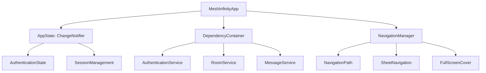

# Mesh Infinity Technical Specification

## UI Platform Direction (Updated)

Mesh Infinity uses a **Flutter UI-only** layer for all supported platforms (Android primary, iOS incidental, desktop) while keeping the Rust backend as the trusted security boundary. The UI does not implement cryptography, transport, or storage primitives; it only renders state and issues user-intent commands through a minimal, audited boundary.

**Note:** Slint UI documentation is archival and kept only for parity checks. Flutter is the canonical UI.

### Canonical UI

- **Flutter** is the canonical UI across platforms.
- **Slint** and **SwiftUI** are deprecated and not part of the build; references are archival only.
- Brand assets live in `assets/logo.png` and should be used for app icons and in-app branding.

### UI ↔ Rust Boundary (Security Constraints)

- The Rust core is the source of truth for identities, keys, transport, and storage.
- The UI is treated as **untrusted**; it must not hold secrets or perform cryptographic operations.
- All UI-to-core calls are **versioned, typed, and validated**. Do not expose low-level networking or crypto primitives to the UI layer.
- Prefer **minimal, intent-based APIs** (e.g., "send_message", "create_room", "pair_peer") over raw configuration access.
- No cloud services or vendor SDK dependencies (e.g., Google Play Services, Apple/Microsoft cloud APIs).

### UI Integration

- Use `dart:ffi` to bind to the Rust FFI module and keep platform channels thin.
- Generated bindings must be stable and audited; schema validation is required for structured payloads.
- FFI error codes are mapped to user-facing error models without leaking internal details.

### Data Handling

- Sensitive data (keys, peer secrets) stays in Rust memory using secure memory primitives.
- Dart receives only redacted identifiers or display-safe metadata.
- All inbound/outbound payloads crossing the FFI boundary must be size-checked and sanitized.

## Flutter UI Implementation
## Settings Panel Enhancements
### Settings Panel
- **Network Backends**: Contains toggles for transport flags, VPN routes, clearnet routes, and a statistics view.
- **Peers**: Divided into *Trusted Peers* and *Discovered/Added Peers* sections. Each peer profile displays identity, trust level, available transports, and connection metrics. Profiles are selectable to view detailed information.
- **Services**: Allows configuration of hosted services, specifying service name, path, and address. Supports enabling/disabling services.
- **Advanced**: Contains a slider to toggle visibility of advanced statistics such as node health, packet loss, latency, and bandwidth usage.
### Files Section
Provides controls for hosting, sending, and receiving files. Exposes APIs for file transfer initiation, progress monitoring, and cancellation.
### UI ↔ Rust Boundary
New FFI endpoints are required to expose the above functionality:
- `mi_get_network_stats`
- `mi_get_peer_list`
- `mi_get_service_list`
- `mi_configure_service`
- `mi_toggle_transport_flag`
- `mi_set_vpn_route`
- `mi_set_clearnet_route`
- `mi_file_transfer_start`
- `mi_file_transfer_cancel`
- `mi_file_transfer_status`
### Navigation
Adds a new `settings` destination with sub-destinations for each tab. NavigationManager will expose methods to navigate to specific tabs.
### State Management
Introduces `SettingsViewModel` and `PeerListViewModel` to fetch and expose data via the new FFI calls.
### Testing
Unit tests for new view models, widget tests for tab navigation, integration tests for FFI calls.

The Mesh Infinity application is built using Flutter with a modern MVVM architecture, following the patterns established in the Android mobile UI while leveraging native Flutter technologies.

### Architecture Overview



### Main Application Entry Point

```dart
// main.dart
void main() {
  runApp(const MeshInfinityApp());
}

class MeshInfinityApp extends StatelessWidget {
  const MeshInfinityApp({super.key});
  
  @override
  Widget build(BuildContext context) {
    return MaterialApp(
      title: 'Mesh Infinity',
      theme: ThemeData(
        colorScheme: ColorScheme.fromSeed(seedColor: const Color(0xFF2C6EE2)),
        useMaterial3: true,
      ),
      home: const ChatShell(),
    );
  }
}
```

### State Management System

```dart
// app_state.dart
class AppState extends ChangeNotifier {
  AuthenticationState _authenticationState = AuthenticationState.unknown;
  Session? _currentSession;
  ThemeMode _themeMode = ThemeMode.light;
  bool _isLoading = false;
  AppError? _error;
  
  AuthenticationState get authenticationState => _authenticationState;
  Session? get currentSession => _currentSession;
  ThemeMode get themeMode => _themeMode;
  bool get isLoading => _isLoading;
  AppError? get error => _error;
  
  void setAuthenticationState(AuthenticationState state) {
    _authenticationState = state;
    notifyListeners();
  }
  
  void setCurrentSession(Session session) {
    _currentSession = session;
    notifyListeners();
  }
  
  void setThemeMode(ThemeMode mode) {
    _themeMode = mode;
    notifyListeners();
  }
  
  void setIsLoading(bool loading) {
    _isLoading = loading;
    notifyListeners();
  }
  
  void setError(AppError error) {
    _error = error;
    notifyListeners();
  }
}

enum AuthenticationState {
  unknown,
  authenticated,
  notAuthenticated
}
```

### Dependency Injection Framework

```dart
// dependency_container.dart
abstract class DependencyContainer {
  AuthenticationService get authenticationService;
  RoomService get roomService;
  MessageService get messageService;
  UserService get userService;
  MediaService get mediaService;
  NotificationService get notificationService;
  AnalyticsService get analyticsService;
}

class AppDependencyContainer implements DependencyContainer {
  final AuthenticationService authenticationService;
  final RoomService roomService;
  final MessageService messageService;
  final UserService userService;
  final MediaService mediaService;
  final NotificationService notificationService;
  final AnalyticsService analyticsService;
  
  AppDependencyContainer()
      : authenticationService = DefaultAuthenticationService(),
        roomService = DefaultRoomService(),
        messageService = DefaultMessageService(),
        userService = DefaultUserService(),
        mediaService = DefaultMediaService(),
        notificationService = DefaultNotificationService(),
        analyticsService = DefaultAnalyticsService();
}
```

### Navigation System

```dart
// navigation_manager.dart
enum NavigationDestination {
  login,
  home,
  room,
  roomDetails,
  userProfile,
  settings,
  mediaViewer,
  search,
  createRoom,
  notifications
}

class NavigationManager extends ChangeNotifier {
  final List<NavigationDestination> _path = [];
  NavigationDestination? _presentedSheet;
  NavigationDestination? _fullScreenCover;
  
  List<NavigationDestination> get path => _path;
  NavigationDestination? get presentedSheet => _presentedSheet;
  NavigationDestination? get fullScreenCover => _fullScreenCover;
  
  void navigateTo(NavigationDestination destination) {
    _path.add(destination);
    notifyListeners();
  }
  
  void navigateBack() {
    if (_path.isNotEmpty) {
      _path.removeLast();
      notifyListeners();
    }
  }
  
  void navigateToRoot() {
    _path.clear();
    notifyListeners();
  }
  
  void presentSheet(NavigationDestination destination) {
    _presentedSheet = destination;
    notifyListeners();
  }
  
  void dismissSheet() {
    _presentedSheet = null;
    notifyListeners();
  }
  
  void presentFullScreenCover(NavigationDestination destination) {
    _fullScreenCover = destination;
    notifyListeners();
  }
  
  void dismissFullScreenCover() {
    _fullScreenCover = null;
    notifyListeners();
  }
}
```

### Root Navigation Flow

```dart
// root_view.dart
class RootView extends StatelessWidget {
  const RootView({super.key});
  
  @override
  Widget build(BuildContext context) {
    final appState = Provider.of<AppState>(context);
    final navigationManager = Provider.of<NavigationManager>(context);
    
    return Scaffold(
      body: Builder(
        builder: (context) {
          switch (appState.authenticationState) {
            case AuthenticationState.unknown:
              return const SplashScreenView();
            case AuthenticationState.authenticated:
              return MainTabView(navigationManager: navigationManager);
            case AuthenticationState.notAuthenticated:
              return AuthenticationView(navigationManager: navigationManager);
          }
        },
      ),
    );
  }
}
```

### Main UI Components

**Room List View**
```dart
class RoomListView extends StatefulWidget {
  const RoomListView({super.key});
  
  @override
  State<RoomListView> createState() => _RoomListViewState();
}

class _RoomListViewState extends State<RoomListView> {
  final RoomListViewModel viewModel = RoomListViewModel();
  final NavigationManager navigationManager = NavigationManager();
  
  @override
  void initState() {
    super.initState();
    viewModel.loadRooms();
  }
  
  @override
  Widget build(BuildContext context) {
    return ListView.builder(
      itemCount: viewModel.rooms.length,
      itemBuilder: (context, index) {
        final room = viewModel.rooms[index];
        return RoomRowView(
          room: room,
          onTap: () => navigationManager.navigateTo(NavigationDestination.room(roomId: room.id)),
        );
      },
    );
  }
}
```

**Message Composer**
```dart
class MessageComposerView extends StatefulWidget {
  final Function(String) onSendMessage;
  final Function() onAttachment;
  
  const MessageComposerView({
    super.key,
    required this.onSendMessage,
    required this.onAttachment,
  });
  
  @override
  State<MessageComposerView> createState() => _MessageComposerViewState();
}

class _MessageComposerViewState extends State<MessageComposerView> {
  final TextEditingController _controller = TextEditingController();
  
  @override
  Widget build(BuildContext context) {
    return Row(
      children: [
        Expanded(
          child: TextField(
            controller: _controller,
            decoration: InputDecoration(
              hintText: 'Type a message...',
              filled: true,
              fillColor: Colors.grey[200],
              border: OutlineInputBorder(
                borderRadius: BorderRadius.circular(20),
                borderSide: BorderSide.none,
              ),
            ),
            onSubmitted: (text) {
              if (text.isNotEmpty) {
                widget.onSendMessage(text);
                _controller.clear();
              }
            },
          ),
        ),
        IconButton(
          icon: const Icon(Icons.attach_file),
          onPressed: widget.onAttachment,
        ),
        IconButton(
          icon: const Icon(Icons.send),
          onPressed: () {
            if (_controller.text.isNotEmpty) {
              widget.onSendMessage(_controller.text);
              _controller.clear();
            }
          },
        ),
      ],
    );
  }
}
```

### ViewModel Architecture

```dart
class RoomListViewModel extends ChangeNotifier {
  List<Room> _rooms = [];
  bool _isLoading = false;
  final RoomService roomService;
  
  List<Room> get rooms => _rooms;
  bool get isLoading => _isLoading;
  
  RoomListViewModel({RoomService? roomService})
      : roomService = roomService ?? ServiceLocator.shared.roomService;
  
  Future<void> loadRooms() async {
    _isLoading = true;
    notifyListeners();
    
    try {
      _rooms = await roomService.getRooms();
    } catch (e) {
      // Handle error
    } finally {
      _isLoading = false;
      notifyListeners();
    }
  }
}
```

### Error Handling System

```dart
enum AppErrorType {
  authenticationFailed,
  networkError,
  invalidSession,
  unknownError
}

class AppError {
  final AppErrorType type;
  final String message;
  final dynamic error;
  
  AppError(this.type, this.message, [this.error]);
  
  String get title {
    switch (type) {
      case AppErrorType.authenticationFailed:
        return 'Authentication Failed';
      case AppErrorType.networkError:
        return 'Network Error';
      case AppErrorType.invalidSession:
        return 'Invalid Session';
      case AppErrorType.unknownError:
        return 'Error';
    }
  }
}
```

### Performance Considerations

- **State Management**: Uses `ChangeNotifier` with `Provider` for reactive updates
- **Navigation**: Implements Flutter's `Navigator` for efficient state-based navigation
- **Memory**: Uses `StatefulWidget` for proper widget lifecycle management
- **Concurrency**: Leverages `async/await` for all network operations
- **UI Updates**: Implements lazy loading and pagination for large datasets

### Security Considerations

- **Data Protection**: Uses Flutter Secure Storage for secure credential storage
- **Network Security**: Implements TLS pinning for all network requests
- **Authentication**: Uses biometric authentication for sensitive operations
- **Session Management**: Implements secure session persistence with encryption

### Testing Strategy

- **Unit Tests**: Comprehensive testing for view models and services
- **Widget Tests**: Integration tests for critical user flows
- **Integration Tests**: Visual regression testing for UI components
- **Performance Tests**: Memory and CPU usage monitoring

### Internationalization and Accessibility

- **Localization**: Full support for multiple languages using Flutter's localization
- **Accessibility**: Comprehensive screen reader support and dynamic type
- **Dark Mode**: Full support for light/dark mode with custom themes

This Flutter UI implementation provides a native experience across all platforms while maintaining the architectural patterns and user experience of the Android version, leveraging modern Flutter technologies and design principles.

## Core System Architecture

Mesh Infinity is built as a **PMWAN (Private Mesh Wide Area Network)** - a complete networking platform that provides:

1. **Encrypted P2P Mesh Network** - Decentralized communication using Tor/I2P/WireGuard
2. **System-Wide VPN/Proxy** - Routes all device traffic through the mesh
3. **Exit Node Network** - Access internet through trusted mesh peers
4. **Hop-by-Hop Routing** - Discovery-driven, topology-based routing with no predetermined paths
5. **Multi-Layer Message Security** - Sign, encrypt, re-sign, encrypt scheme for all communications

### Mesh Addressing Scheme

Mesh Infinity uses a **256-bit addressing scheme** (8 groups of 8 hexadecimal characters):

```
a1b2c3d4:e5f6a7b8:12345678:90abcdef:01234567:89abcdef:fedcba98:76543210
└────────────── device address (20 bytes) ──────────────┘└── conversation ID (12 bytes) ──┘
```

#### Address Structure

- **Device Address (160 bits / 20 bytes)**: First 5 groups - identifies a device endpoint
- **Conversation ID (96 bits / 12 bytes)**: Last 3 groups - identifies a specific conversation within a connection

#### Address Types

| Type | Description | Sharing |
|------|-------------|---------|
| **Primary** | Deterministic from public key, shared publicly | Shared with anyone |
| **Trusted Channel** | Negotiated per trusted peer relationship | Never shared publicly |
| **Ephemeral** | Random, temporary for single sessions | Disposable |

#### Conversation Identification

Conversations are uniquely identified by the tuple:
```
(source_address, destination_address, conversation_id)
```

This enables:
- Multiple concurrent conversations to the same peer
- Privacy through address separation (primary vs trusted channel)
- Session isolation without exposing identities

### Hop-by-Hop Routing

Mesh Infinity uses **discovery-driven, hop-by-hop routing** where:

- **Each node only decides the next hop** - no predetermined end-to-end paths
- **Links stay open until delivery** - no acknowledgments or retransmission
- **Routing tables built from discovery** - neighbors share reachability announcements
- **Trust-weighted paths** - routing considers Web of Trust relationships

```
┌─────────────────────────────────────────────────────────────┐
│  Routing Model                                               │
├─────────────────────────────────────────────────────────────┤
│                                                              │
│  Node A ──────► Node B ──────► Node C ──────► Node D        │
│     │              │              │              │           │
│  "Next hop        "Next hop      "Next hop      Destination │
│   is B"            is C"          is D"                      │
│                                                              │
│  Each node only knows its neighbors and their reachability  │
│  No node knows the complete path                            │
└─────────────────────────────────────────────────────────────┘
```

#### Reachability Announcements

Nodes share routing information via announcements:
```rust
ReachabilityAnnouncement {
    destination: DeviceAddress,   // Who can be reached
    hop_count: u8,                // How many hops away
    latency_estimate_ms: u32,     // Cumulative latency
    path_trust: TrustLevel,       // Minimum trust along path
}
```

### Message Encryption Scheme

All messages use a **multi-layer signing and encryption scheme** that ensures:
- Authenticity at every hop
- Privacy of sender identity
- Trust verification for trusted channels

#### Encryption Process

```
┌─────────────────────────────────────────────────────────────┐
│  Step 1: Sign with sender's private key                      │
│  ┌─────────────────────────────────────────────────────────┐│
│  │ signature = Ed25519_Sign(sender_private_key, message)  ││
│  │ signed_message = message || signature                   ││
│  └─────────────────────────────────────────────────────────┘│
├─────────────────────────────────────────────────────────────┤
│  Step 2: If trusted, encrypt with trust-pair key            │
│  ┌─────────────────────────────────────────────────────────┐│
│  │ if (mutual_trust) {                                     ││
│  │   trust_encrypted = AES256_GCM(                         ││
│  │     trust_channel_key,  // Derived from both keys       ││
│  │     signed_message                                       ││
│  │   )                                                      ││
│  │ } else {                                                 ││
│  │   trust_encrypted = signed_message                       ││
│  │ }                                                        ││
│  └─────────────────────────────────────────────────────────┘│
├─────────────────────────────────────────────────────────────┤
│  Step 3: Re-sign the encrypted content                       │
│  ┌─────────────────────────────────────────────────────────┐│
│  │ outer_signature = Ed25519_Sign(                         ││
│  │   sender_private_key,                                    ││
│  │   trust_encrypted                                        ││
│  │ )                                                        ││
│  │ double_signed = trust_encrypted || outer_signature       ││
│  └─────────────────────────────────────────────────────────┘│
├─────────────────────────────────────────────────────────────┤
│  Step 4: Encrypt with recipient's global public key          │
│  ┌─────────────────────────────────────────────────────────┐│
│  │ final_message = X25519_Box(                             ││
│  │   recipient_public_key,                                  ││
│  │   ephemeral_keypair,                                     ││
│  │   double_signed                                          ││
│  │ )                                                        ││
│  └─────────────────────────────────────────────────────────┘│
└─────────────────────────────────────────────────────────────┘
```

#### Security Properties

| Property | How Achieved |
|----------|--------------|
| **Sender authenticity** | Inner signature (Step 1) |
| **Trust verification** | Trust-pair encryption (Step 2) |
| **Forwarding authenticity** | Outer signature (Step 3) |
| **Sender privacy** | Final encryption (Step 4) hides sender identity |
| **Recipient privacy** | Only recipient can decrypt |

#### For Network Connections

Ongoing network connections (files, streams) use the same scheme for the **handshake**, which derives a session key. Subsequent data uses the session key for performance:

```rust
// Handshake: Full 4-step encryption
let handshake = encrypt_message(session_proposal, ...);
send(handshake);

// After handshake: Session key for data
let session_key = derive_session_key(handshake_result);
let encrypted_data = AES256_GCM(session_key, data);
```

### PMWAN Overview

```
┌──────────────────────────────────────────────────────────┐
│  Application Layer                                       │
│  • Web browsers, SSH clients, messaging apps            │
│  • Connect via mesh addresses (256-bit)                  │
└────────────────────────┬─────────────────────────────────┘
                         ↓
┌──────────────────────────────────────────────────────────┐
│  Mesh Infinity VPN Service (Virtual Interface)             │
│  • Captures all traffic to mesh network                  │
│  • Mesh address ↔ peer resolution                        │
│  • Traffic shaping and QoS                               │
└────────────────────────┬─────────────────────────────────┘
                         ↓
┌──────────────────────────────────────────────────────────┐
│  Hop-by-Hop Router                                       │
│  • Next-hop decisions based on topology discovery        │
│  • No predetermined paths                                │
│  • Links maintained until delivery (no ACK/retransmit)  │
│  • Trust-weighted route selection                        │
└────────────────────────┬─────────────────────────────────┘
                         ↓
┌──────────────────────────────────────────────────────────┐
│  Message Crypto Layer                                    │
│  • Sign → [Trust Encrypt] → Re-sign → Final Encrypt      │
│  • Session key derivation for ongoing connections        │
│  • Perfect Forward Secrecy via key ratcheting            │
└────────────────────────┬─────────────────────────────────┘
                         ↓
┌──────────────────────────────────────────────────────────┐
│  Multi-Transport Layer                                   │
│  • Tor (primary - censorship resistance)                 │
│  • I2P (fallback - alternative anonymous network)        │
│  • WireGuard mesh (direct - low latency)                 │
│  • Clearnet (optional - when anonymity not required)     │
└──────────────────────────────────────────────────────────┘
```

### On-Device Routing (Tailscale-like)

Mesh Infinity provides system-wide VPN functionality where users control how traffic is routed:

| Traffic Type | Routing Options |
|--------------|-----------------|
| **Mesh traffic** | Always routes through mesh (hop-by-hop) |
| **Non-mesh traffic** | User choice: Direct internet OR via exit node |

**Modes:**
- **Mesh Only**: Only mesh traffic uses the mesh; internet goes direct
- **Exit Node**: All traffic routes through a selected mesh peer (exit node)
- **Policy-Based**: Custom rules (e.g., work traffic → specific exit, streaming → low-latency exit)

### Key Features

- **256-bit Mesh Addresses**: Flexible addressing with device + conversation separation
- **Hop-by-Hop Routing**: Decentralized, discovery-driven, no predetermined paths
- **Multi-Layer Crypto**: Sign, encrypt, re-sign, encrypt for all messages
- **Trusted Channels**: Private addresses per trust relationship
- **Session Keys**: Handshake-derived keys for efficient ongoing connections
- **On-Device Routing**: Tailscale-like control over traffic routing
- **Platform Integration**: Network Extension (iOS/macOS), VPN Service (Android), TUN/TAP (Linux/Windows)

See [PMWAN_ARCHITECTURE.md](PMWAN_ARCHITECTURE.md) for complete technical details.

## Rust Backend Structure

```rust
// Root Cargo.toml (single package)
[package]
name = "mesh-infinity"
version = "0.1.0"
edition = "2021"

[lib]
name = "mesh_infinity"
crate-type = ["cdylib", "staticlib", "rlib"]

[dependencies]
# (core + transport + crypto + auth + mesh + discovery + ffi)
```

### Unified Module Layout

```
src/
  lib.rs             // re-exports backend + modules
  runtime.rs         // runtime config (UI-enabled, node mode)
backend/
  core/              // core types + transport + mesh internals
  auth/
  crypto/
  mesh/
  transport/
  discovery/
  ffi/               // C ABI surface for UI shells (legacy Flutter)
  src/               // MeshInfinityService + app-facing API
```

### FFI Interface Design

```rust
// ffi/src/lib.rs - Public FFI interface
use std::os::raw::c_char;
use std::ffi::{CStr, CString};

#[repr(C)]
pub struct MeshConfig {
    pub config_path: *const c_char,
    pub log_level: u8,
    pub enable_tor: bool,
    pub enable_clearnet: bool,
    pub mesh_discovery: bool,
    pub allow_relays: bool,
    pub enable_i2p: bool,
    pub enable_bluetooth: bool,
    pub wireguard_port: u16,
    pub max_peers: u32,
    pub max_connections: u32,
    pub node_mode: u8, // 0=Client, 1=Server, 2=Dual
}

#[repr(C)]
pub struct PeerInfo {
    pub peer_id: [u8; 32],
    pub public_key: [u8; 32],
    pub trust_level: u8,
    pub available_transports: u32, // Bitmask
}

#[repr(C)]
pub struct Message {
    pub sender_id: [u8; 32],
    pub target_id: [u8; 32],
    pub payload: *const u8,
    pub payload_len: usize,
    pub timestamp: u64,
}

// FFI Functions
#[no_mangle]
pub extern "C" fn mesh_init(config: *const MeshConfig) -> *mut MeshContext {
    // Initialize mesh context
}

#[no_mangle]
pub extern "C" fn mi_set_node_mode(ctx: *mut MeshContext, mode: u8) -> i32 {
    // Runtime toggle: Client / Server / Dual
}

#[no_mangle]
pub extern "C" fn mesh_send_message(
    ctx: *mut MeshContext,
    message: *const Message
) -> i32 {
    // Send encrypted message
}

#[no_mangle]
pub extern "C" fn mesh_receive_messages(
    ctx: *mut MeshContext,
    callback: extern fn(*const Message, *mut std::os::raw::c_void),
    user_data: *mut std::os::raw::c_void
) {
    // Stream received messages
}

#[no_mangle]
pub extern "C" fn mesh_destroy(ctx: *mut MeshContext) {
    // Cleanup resources
}
```

### Runtime Modes (Server / Client / Dual)

- The application is always built as a complete bundle.
- **UI enabled at startup** ⇒ backend starts in **Client** or **Dual** mode (based on runtime config).
- **UI disabled at startup** ⇒ backend starts in **Server** mode.
- At runtime, the UI can switch between **Client** and **Dual** by calling `mi_set_node_mode`.
- Server mode exposes server-side components for trusted instances; Client mode is UI-backed only.

### Transport Layer Implementation

```rust
// transport/src/lib.rs
use std::net::{SocketAddr, UdpSocket};
use std::sync::{Arc, Mutex};
use tokio::net::UdpSocket as TokioUdpSocket;
use arti_client::{TorClient, TorClientConfig};

pub trait Transport: Send + Sync {
    fn connect(&self, peer: &PeerInfo) -> Result<Box<dyn Connection>>;
    fn listen(&self) -> Result<Box<dyn Listener>>;
    fn priority(&self) -> u8;
    fn transport_type(&self) -> TransportType;
    fn is_available(&self) -> bool;
}

pub struct TransportManager {
    transports: HashMap<TransportType, Arc<dyn Transport>>,
    active_connections: Arc<Mutex<HashMap<PeerId, Vec<ConnectionInfo>>>>,
}

impl TransportManager {
    pub async fn get_best_connection(
        &self, 
        target: &PeerId, 
        preferred: &[TransportType]
    ) -> Result<ConnectionInfo> {
        // Try transports in priority order
        for transport_type in preferred {
            if let Some(transport) = self.transports.get(transport_type) {
                if transport.is_available() {
                    // Test connection quality
                    if let Ok(conn) = transport.connect(target).await {
                        return Ok(ConnectionInfo {
                            transport: transport_type.clone(),
                            connection: conn,
                            quality: self.measure_quality(&conn).await,
                        });
                    }
                }
            }
        }
        Err(Error::NoAvailableTransport)
    }
}
```

### WireGuard Mesh Implementation

```rust
// mesh/src/wireguard.rs
use boringtun::device::{Device, DeviceConfig};
use boringtun::noise::Tunn;
use std::sync::Arc;

pub struct WireGuardMesh {
    device: Arc<Device>,
    peers: Arc<Mutex<HashMap<PeerId, WGPeer>>>,
    routing_table: Arc<RwLock<RoutingTable>>,
}

pub struct WGPeer {
    public_key: [u8; 32],
    allowed_ips: Vec<IpNetwork>,
    endpoint: Option<SocketAddr>,
    persistent_keepalive: Option<u16>,
    latest_handshake: Option<SystemTime>,
}

impl WireGuardMesh {
    pub fn new(config: &WGConfig) -> Result<Self> {
        let device_config = DeviceConfig {
            name: config.interface.clone(),
            private_key: config.private_key,
            listen_port: config.port,
            mtu: config.mtu,
            ..Default::default()
        };
        
        let device = Device::new(device_config)?;
        
        Ok(WireGuardMesh {
            device: Arc::new(device),
            peers: Arc::new(Mutex::new(HashMap::new())),
            routing_table: Arc::new(RwLock::new(RoutingTable::new())),
        })
    }
    
    pub fn add_peer(&self, peer: WGPeer) -> Result<()> {
        // Add peer to WireGuard device
        self.device.add_peer(&peer.public_key, &peer.allowed_ips)?;
        
        // Update routing table
        let mut routing_table = self.routing_table.write().unwrap();
        for ip in &peer.allowed_ips {
            routing_table.add_route(*ip, peer.public_key);
        }
        
        // Store peer info
        self.peers.lock().unwrap().insert(peer.public_key.into(), peer);
        
        Ok(())
    }
}
```

### Cryptographic Protocol Implementation

```rust
// crypto/src/pfs.rs
use ring::{agreement, digest, hkdf};
use x25519_dalek::{EphemeralSecret, PublicKey};
use std::time::{SystemTime, Duration};

pub struct PFSManager {
    current_sessions: HashMap<PeerId, SessionKeys>,
    key_history: HashMap<PeerId, VecDeque<SessionKeys>>,
    rotation_interval: Duration,
    max_history: usize,
}

pub struct SessionKeys {
    encryption_key: [u8; 32],
    mac_key: [u8; 32],
    ratchet_state: RatchetState,
    created_at: SystemTime,
    expires_at: SystemTime,
}

impl PFSManager {
    pub fn new_session(&mut self, peer_id: &PeerId, shared_secret: &[u8]) -> SessionKeys {
        let now = SystemTime::now();
        let expires_at = now + self.rotation_interval;
        
        // Derive initial keys
        let keys = self.derive_keys(shared_secret, b"initial");
        
        let session = SessionKeys {
            encryption_key: keys.encryption_key,
            mac_key: keys.mac_key,
            ratchet_state: RatchetState::new(),
            created_at: now,
            expires_at,
        };
        
        // Store in current sessions
        self.current_sessions.insert(*peer_id, session.clone());
        
        // Rotate old keys
        self.rotate_keys(peer_id);
        
        session
    }
    
    pub fn ratchet_session(&mut self, peer_id: &PeerId) -> Result<SessionKeys> {
        let current = self.current_sessions.get_mut(peer_id)
            .ok_or(Error::NoActiveSession)?;
        
        // Ratchet the key
        current.ratchet_state.ratchet();
        
        // Derive new keys
        let new_keys = self.derive_keys_from_ratchet(&current.ratchet_state);
        
        // Update session
        current.encryption_key = new_keys.encryption_key;
        current.mac_key = new_keys.mac_key;
        current.created_at = SystemTime::now();
        
        Ok(current.clone())
    }
    
    fn rotate_keys(&mut self, peer_id: &PeerId) {
        if let Some(current) = self.current_sessions.remove(peer_id) {
            let history = self.key_history.entry(*peer_id).or_insert_with(VecDeque::new);
            history.push_back(current);
            
            // Limit history size
            while history.len() > self.max_history {
                history.pop_front();
            }
        }
    }
}
```

### Web of Trust Implementation

```rust
// auth/src/web_of_trust.rs
use std::collections::{HashMap, HashSet};
use std::sync::{Arc, RwLock};

#[derive(Debug, Clone, Copy, PartialEq, Eq, PartialOrd, Ord)]
pub enum TrustLevel {
    Untrusted = 0,
    Caution = 1,
    Trusted = 2,
    HighlyTrusted = 3,
}

pub struct WebOfTrust {
    my_identity: Identity,
    trust_graph: Arc<RwLock<HashMap<PeerId, TrustRelationship>>>,
    trust_propagation: TrustPropagation,
}

pub struct TrustRelationship {
    peer_id: PeerId,
    trust_level: TrustLevel,
    verification_methods: Vec<VerificationMethod>,
    shared_secrets: Vec<SharedSecret>,
    trust_endorsements: Vec<TrustEndorsement>,
    last_seen: SystemTime,
}

impl WebOfTrust {
    pub fn verify_peer(&self, peer_id: &PeerId, trust_markers: &[TrustMarker]) -> TrustLevel {
        let graph = self.trust_graph.read().unwrap();
        
        // Direct trust
        if let Some(rel) = graph.get(peer_id) {
            if rel.trust_level >= TrustLevel::Trusted {
                return rel.trust_level;
            }
        }
        
        // Propagated trust
        let propagated_trust = self.calculate_propagated_trust(peer_id, trust_markers);
        
        // Combined trust (highest of direct and propagated)
        propagated_trust
    }
    
    pub fn add_trust_endorsement(
        &self, 
        endorser: &PeerId, 
        target: &PeerId, 
        endorsement: TrustEndorsement
    ) -> Result<()> {
        let mut graph = self.trust_graph.write().unwrap();
        
        if let Some(rel) = graph.get_mut(target) {
            rel.trust_endorsements.push(endorsement);
            
            // Recalculate trust based on endorsements
            let new_trust = self.calculate_trust_from_endorsements(rel);
            rel.trust_level = new_trust;
        }
        
        Ok(())
    }
    
    fn calculate_propagated_trust(
        &self, 
        target: &PeerId, 
        trust_markers: &[TrustMarker]
    ) -> TrustLevel {
        let graph = self.trust_graph.read().unwrap();
        
        // Find all trusted peers that know about target
        let mut endorsing_peers = Vec::new();
        
        for (peer_id, rel) in graph.iter() {
            if rel.trust_level >= TrustLevel::Trusted {
                // Check if this peer has endorsed target
                if self.peer_knows_about(peer_id, target, trust_markers) {
                    endorsing_peers.push((peer_id, rel.trust_level));
                }
            }
        }
        
        // Calculate weighted trust
        let mut total_trust = 0;
        let mut weight_sum = 0;
        
        for (peer_id, trust_level) in endorsing_peers {
            let weight = match trust_level {
                TrustLevel::Trusted => 1,
                TrustLevel::HighlyTrusted => 2,
                _ => 0,
            };
            
            total_trust += weight * trust_level as u8;
            weight_sum += weight;
        }
        
        if weight_sum > 0 {
            let avg_trust = total_trust / weight_sum;
            match avg_trust {
                0..=1 => TrustLevel::Untrusted,
                2..=3 => TrustLevel::Caution,
                4..=5 => TrustLevel::Trusted,
                _ => TrustLevel::HighlyTrusted,
            }
        } else {
            TrustLevel::Untrusted
        }
    }
}
```

### Message Routing Implementation

```rust
// mesh/src/routing.rs
use std::collections::{HashMap, HashSet};
use std::sync::{Arc, RwLock};

pub struct RoutingTable {
    routes: Arc<RwLock<HashMap<PeerId, RouteInfo>>>,
    path_cache: Arc<RwLock<HashMap<(PeerId, PeerId), Vec<PathInfo>>>>,
}

pub struct RouteInfo {
    primary_path: PathInfo,
    backup_paths: Vec<PathInfo>,
    last_updated: SystemTime,
    quality_score: f32,
}

pub struct PathInfo {
    transport: TransportType,
    endpoint: Endpoint,
    latency: Option<Duration>,
    reliability: f32,
    bandwidth: Option<u64>,
    cost: f32,
}

impl RoutingTable {
    pub fn get_best_route(&self, target: &PeerId) -> Option<RouteInfo> {
        let routes = self.routes.read().unwrap();
        routes.get(target).cloned()
    }
    
    pub fn calculate_paths(
        &self, 
        source: &PeerId, 
        target: &PeerId,
        available_transports: &[TransportType]
    ) -> Vec<PathInfo> {
        // Dijkstra's algorithm for pathfinding
        let mut distances = HashMap::new();
        let mut previous = HashMap::new();
        let mut unvisited = HashSet::new();
        
        // Initialize
        for peer in self.get_all_peers() {
            distances.insert(peer, f32::INFINITY);
            unvisited.insert(peer);
        }
        
        distances.insert(*source, 0.0);
        
        while !unvisited.is_empty() {
            // Find unvisited node with smallest distance
            let current = unvisited.iter()
                .min_by(|a, b| distances.get(a).partial_cmp(distances.get(b)).unwrap())
                .copied();
            
            let current = match current {
                Some(c) => c,
                None => break,
            };
            
            unvisited.remove(&current);
            
            if current == *target {
                break;
            }
            
            // Check neighbors
            for neighbor in self.get_neighbors(&current) {
                let alt = distances[&current] + self.calculate_path_cost(&current, &neighbor, available_transports);
                
                if alt < distances[&neighbor] {
                    distances.insert(neighbor, alt);
                    previous.insert(neighbor, current);
                }
            }
        }
        
        // Reconstruct path
        self.reconstruct_path(source, target, &previous)
    }
    
    fn calculate_path_cost(
        &self, 
        from: &PeerId, 
        to: &PeerId,
        preferred_transports: &[TransportType]
    ) -> f32 {
        let routes = self.routes.read().unwrap();
        
        if let Some(route) = routes.get(to) {
            // Prefer direct connections
            if route.primary_path.endpoint.peer_id == *to {
                return 1.0;
            }
        }
        
        // Calculate multi-hop cost
        let mut cost = 0.0;
        let mut current = *from;
        
        while current != *to {
            if let Some(route) = routes.get(&current) {
                cost += route.primary_path.cost;
                current = route.primary_path.endpoint.peer_id;
            } else {
                return f32::INFINITY;
            }
        }
        
        cost
    }
}
```

## Flutter UI Integration (FFI-only)

All UI integrations occur through Flutter calling the Rust FFI surface. UI state is derived from backend state via intent-based APIs and event polling.

## Security Considerations

### Memory Safety
- Use `SecureMemory` wrapper for all sensitive data
- Implement `Drop` trait to zero memory on deallocation
- Use `mlock` to prevent swapping of sensitive pages
- Regular memory audits for potential leaks

### Cryptographic Best Practices
- Use constant-time operations for all cryptographic functions
- Implement proper key derivation with unique salts
- Use authenticated encryption (AEAD) for all communications
- Regular key rotation with forward secrecy
- Zero-knowledge proofs for identity verification

### Network Security
- Tor circuit isolation per peer when possible
- Transport layer encryption even over Tor
- Rate limiting to prevent DoS attacks
- Connection validation and peer verification
- Automatic detection of man-in-the-middle attacks

### Privacy Protection
- No persistent logging of sensitive operations
- Traffic pattern obfuscation
- Minimal metadata exposure
- Plausible deniability for all communications
- Emergency data destruction capabilities

## Performance Optimization

### Network Optimization
- Connection pooling for frequently used paths
- Message batching for high-throughput scenarios
- Adaptive MTU discovery for different transports
- Bandwidth estimation and adaptive bitrate
- Quality of service prioritization

### Memory Optimization
- Object pooling for frequently allocated structures
- Lazy loading of non-critical components
- Memory-mapped files for large data structures
- Efficient serialization with bincode
- Garbage collection optimization

### CPU Optimization
- SIMD instructions for cryptographic operations
- Async/await for non-blocking I/O
- Work-stealing thread pools for CPU-bound tasks
- Profile-guided optimization in release builds
- Cache-friendly data structures

This technical specification provides the detailed implementation blueprint for building a highly resilient, censorship-resistant mesh network with strong security and privacy guarantees.
