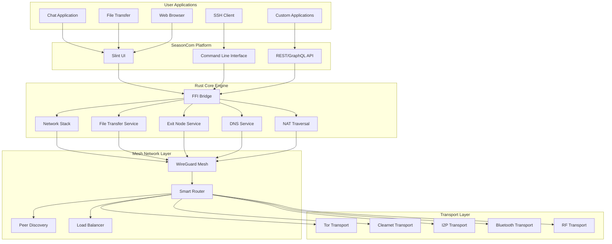
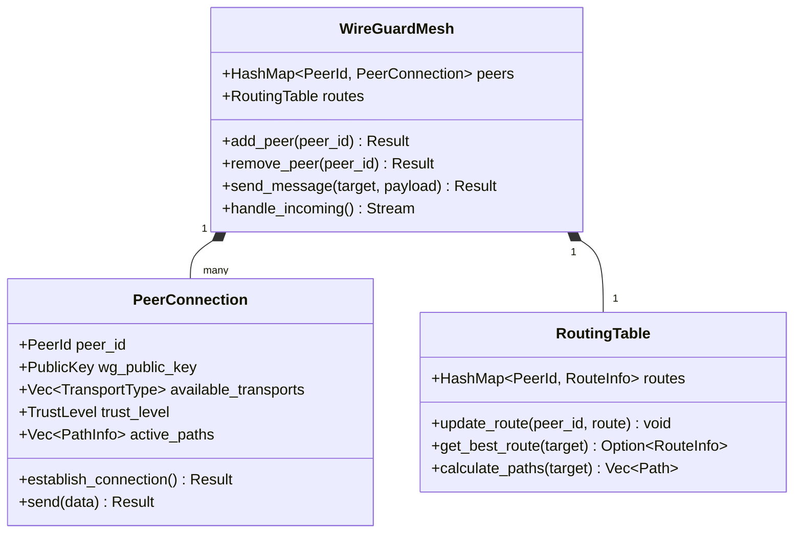
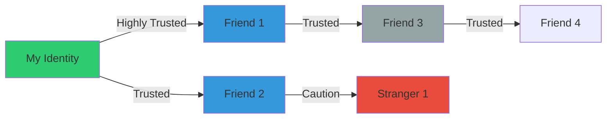
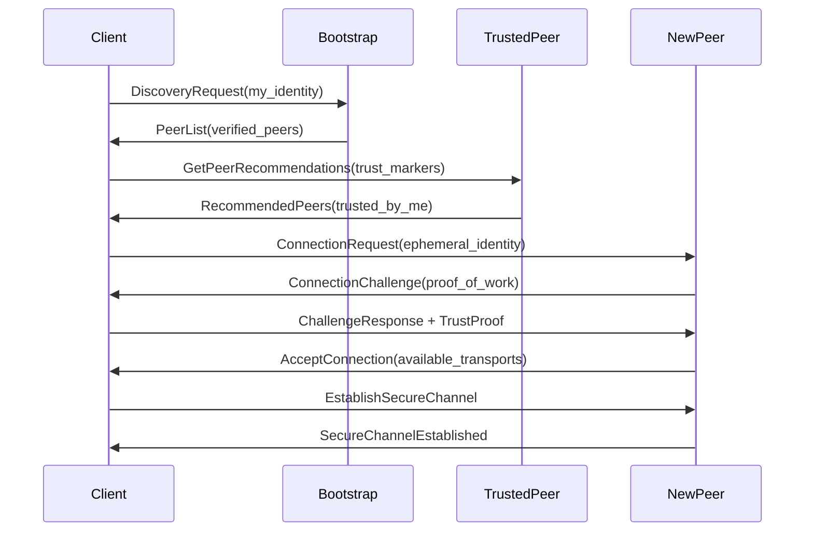
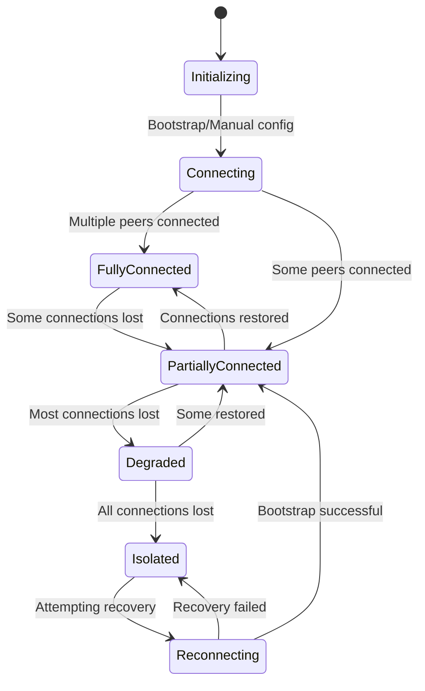

# SeasonCom: Full Mesh Networking Platform Architecture

## Project Name: SeasonCom

A highly resilient, privacy-focused mesh networking platform with Tailscale-like capabilities, supporting full network routing, file transfer, exit nodes, and application integration.

## Core Requirements

**Security Principles (CIA+AR)**:
- **Confidentiality**: E2EE with perfect forward secrecy
- **Integrity**: Message authentication and verification
- **Availability**: Absolute network resilience with multi-path routing
- **Authenticity**: Web-of-trust based authentication
- **Repudiation**: Plausible deniability - no proof of conversation ever occurring

**Platform Capabilities**:
- **Virtual Networking**: TUN/TAP interface for network traffic interception
- **File Transfer**: Chunked file transfer with resume capability
- **Exit Nodes**: Variable exit nodes for internet access
- **DNS Service**: Mesh DNS with service discovery
- **Application Integration**: Protocol handlers for custom applications
- **NAT Traversal**: Comprehensive NAT traversal with STUN/TURN

**Technology Stack**:
- **Backend**: Rust (performance, memory safety, security)
- **Frontend**: Slint (native UI toolkit)
- **Mesh Protocol**: WireGuard
- **Transport Layers**: Tor, Clearnet (I2P, Bluetooth, RF future)

## System Architecture



## Directory Structure

```
net-infinity/
├── backend/                    # Rust backend
│   ├── Cargo.toml
│   ├── src/
│   │   ├── lib.rs             # FFI exports
│   │   ├── core/
│   │   │   ├── mod.rs
│   │   │   └── mesh_engine.rs # Core orchestrator
│   │   ├── transport/
│   │   │   ├── mod.rs
│   │   │   ├── traits.rs      # Transport trait
│   │   │   ├── tor.rs
│   │   │   ├── clearnet.rs
│   │   │   └── manager.rs     # Transport manager
│   │   ├── crypto/
│   │   │   ├── mod.rs
│   │   │   ├── pfs.rs         # Perfect forward secrecy
│   │   │   ├── deniable.rs    # Deniable authentication
│   │   │   └── secmem.rs      # Secure memory handling
│   │   ├── auth/
│   │   │   ├── mod.rs
│   │   │   ├── web_of_trust.rs
│   │   │   └── identity.rs
│   │   ├── mesh/
│   │   │   ├── mod.rs
│   │   │   ├── wireguard.rs
│   │   │   ├── routing.rs
│   │   │   └── peer.rs
│   │   ├── discovery/
│   │   │   ├── mod.rs
│   │   │   ├── bootstrap.rs
│   │   │   └── adaptive.rs
│   │   ├── network_stack/
│   │   │   ├── mod.rs
│   │   │   ├── virtual_interface.rs
│   │   │   ├── dns_resolver.rs
│   │   │   └── nat_traversal.rs
│   │   ├── file_transfer/
│   │   │   ├── mod.rs
│   │   │   ├── chunk_manager.rs
│   │   │   └── transfer_queue.rs
│   │   ├── exit_node/
│   │   │   ├── mod.rs
│   │   │   ├── traffic_router.rs
│   │   │   └── bandwidth_manager.rs
│   │   ├── application_gateway/
│   │   │   ├── mod.rs
│   │   │   ├── protocol_handlers.rs
│   │   │   └── app_registry.rs
│   │   └── security/
│   │       ├── mod.rs
│   │       ├── sandbox.rs
│   │       └── policy_engine.rs
├── frontend/                   # Slint frontend
│   ├── Cargo.toml
│   ├── src/
│   │   ├── main.rs
│   │   ├── ui/
│   │   │   ├── main.slint
│   │   │   ├── network_dashboard.slint
│   │   │   ├── file_transfer.slint
│   │   │   ├── exit_node_manager.slint
│   │   │   ├── dns_manager.slint
│   │   │   ├── chat_screen.slint
│   │   │   ├── peers_screen.slint
│   │   │   └── trust_screen.slint
│   │   ├── integration/
│   │   │   ├── mesh_integration.rs
│   │   │   └── callbacks.rs
│   │   └── cli/
│   │       └── commands.rs
├── protocols/                  # Protocol definitions
│   └── messages.proto
├── config/
│   └── default_config.json
└── docs/
    └── architecture.md
```

## Core Components Design

### 1. Virtual Network Interface

```rust
pub struct VirtualInterface {
    // TUN/TAP device for network traffic interception
    device: Arc<TunDevice>,
    
    // IP address management
    ip_allocator: IpAllocator,
    
    // Route table management
    route_table: RouteTable,
    
    // Packet filtering
    packet_filter: PacketFilter,
    
    // Network namespaces (Linux)
    #[cfg(target_os = "linux")]
    network_namespace: Option<NetworkNamespace>,
}

pub struct NetworkPacket {
    pub source_ip: IpAddr,
    pub destination_ip: IpAddr,
    pub source_port: Option<u16>,
    pub destination_port: Option<u16>,
    pub protocol: Protocol,
    pub payload: Vec<u8>,
    pub interface: String,
    pub timestamp: SystemTime,
    pub is_encrypted: bool,
    pub connection_id: Option<u64>,
}
```

### 2. Network Stack Service

```rust
pub struct NetworkStack {
    // Virtual interface
    virtual_interface: Arc<VirtualInterface>,
    
    // DNS resolution
    dns_resolver: Arc<DnsResolver>,
    
    // NAT traversal
    nat_traversal: Arc<NatTraversal>,
    
    // Port forwarding
    port_forwarder: Arc<PortForwarder>,
    
    // Network address translation
    nat_manager: Arc<NatManager>,
    
    // Connection tracking
    connection_tracker: ConnectionTracker,
}

pub struct PortForward {
    pub local_port: u16,
    pub remote_port: u16,
    pub target_peer: PeerId,
    pub protocol: Protocol,
    pub allowed_ips: Vec<IpNetwork>,
    pub created_at: SystemTime,
    pub expires_at: Option<SystemTime>,
}
```

### 3. File Transfer Service

```rust
pub struct FileTransferService {
    // Chunked file transfer
    chunk_manager: ChunkManager,
    
    // Transfer queue
    transfer_queue: TransferQueue,
    
    // Resume capability
    resume_manager: ResumeManager,
    
    // Encryption
    encryption_manager: EncryptionManager,
    
    // Transfer monitoring
    transfer_monitor: TransferMonitor,
}

pub struct TransferSession {
    pub file_id: Uuid,
    pub file_name: String,
    pub file_size: u64,
    pub chunks: HashMap<u32, ChunkInfo>,
    pub progress: TransferProgress,
    pub encryption_key: [u8; 32],
    pub target_peer: PeerId,
    pub created_at: SystemTime,
    pub last_activity: SystemTime,
    pub transfer_type: TransferType,
    pub priority: TransferPriority,
}
```

### 4. Exit Node Service

```rust
pub struct ExitNodeService {
    // Exit node configuration
    exit_nodes: HashMap<PeerId, ExitNodeConfig>,
    
    // Traffic routing
    traffic_router: TrafficRouter,
    
    // Bandwidth management
    bandwidth_manager: BandwidthManager,
    
    // Exit node selection
    node_selector: ExitNodeSelector,
    
    // Cost calculation
    cost_calculator: CostCalculator,
}

pub struct ExitNodeConfig {
    pub peer_id: PeerId,
    pub public_ip: IpAddr,
    pub allowed_protocols: Vec<Protocol>,
    pub bandwidth_limit: Option<u64>,
    pub cost_per_gb: Option<u64>,
    pub reputation: f32,
    pub exit_node_type: ExitNodeType,
    pub geo_location: Option<GeoLocation>,
}
```

### 5. DNS Service

```rust
pub struct DnsResolver {
    // DNS cache
    cache: DnsCache,
    
    // DNS servers
    dns_servers: Vec<DnsServer>,
    
    // Custom domain mapping
    custom_domains: HashMap<String, IpAddr>,
    
    // Mesh DNS
    mesh_dns: MeshDns,
    
    // DNS over HTTPS support
    doh_enabled: bool,
}

pub struct DnsRecord {
    pub domain: String,
    pub ip_addresses: Vec<IpAddr>,
    pub ttl: Duration,
    pub source: DnsSource,
    pub timestamp: SystemTime,
}
```

### 6. NAT Traversal Service

```rust
pub struct NatTraversal {
    // STUN servers
    stun_servers: Vec<StunServer>,
    
    // TURN servers
    turn_servers: Vec<TurnServer>,
    
    // Hole punching
    hole_puncher: HolePuncher,
    
    // Relay management
    relay_manager: RelayManager,
    
    // NAT type detection
    nat_detector: NatDetector,
}

pub struct NatType {
    pub nat_type: NatClassification,
    pub public_ip: Option<IpAddr>,
    pub port_mapping: Option<PortMapping>,
    pub cone_type: Option<ConeType>,
}
```

### 7. Application Gateway

```rust
pub struct ApplicationGateway {
    // Protocol handlers
    protocol_handlers: HashMap<Protocol, Box<dyn ProtocolHandler>>,
    
    // Application registry
    app_registry: ApplicationRegistry,
    
    // Traffic classification
    traffic_classifier: TrafficClassifier,
    
    // Application policies
    app_policies: HashMap<ApplicationId, ApplicationPolicy>,
}

pub trait ProtocolHandler: Send + Sync {
    fn handle_packet(&self, packet: NetworkPacket) -> Result<NetworkPacket>;
    fn get_protocol(&self) -> Protocol;
    fn get_priority(&self) -> u8;
    fn get_application_id(&self) -> ApplicationId;
}
```

### 8. Security Manager

```rust
pub struct SecurityManager {
    // Application sandboxing
    app_sandbox: ApplicationSandbox,
    
    // Network isolation
    network_isolation: NetworkIsolation,
    
    // Traffic inspection
    traffic_inspector: TrafficInspector,
    
    // Policy enforcement
    policy_engine: PolicyEngine,
    
    // Security audit
    security_audit: SecurityAudit,
}

pub struct SecurityPolicy {
    pub app_id: ApplicationId,
    pub allowed_peers: Vec<PeerId>,
    pub allowed_protocols: Vec<Protocol>,
    pub allowed_ports: Vec<u16>,
    pub bandwidth_limits: BandwidthLimits,
    pub encryption_required: bool,
    pub sandbox_level: SandboxLevel,
}
```

### 9. Transport Abstraction Layer

```rust
// Transport trait for modularity
pub trait Transport: Send + Sync {
    /// Connect to a peer via this transport
    fn connect(&self, peer_info: &PeerInfo) -> Result<Box<dyn Connection>>;
    
    /// Listen for incoming connections
    fn listen(&self) -> Result<Box<dyn Listener>>;
    
    /// Transport priority (lower = higher priority)
    fn priority(&self) -> u8;
    
    /// Transport type identifier
    fn transport_type(&self) -> TransportType;
    
    /// Check if transport is currently available
    fn is_available(&self) -> bool;
    
    /// Measure transport quality
    fn measure_quality(&self, target: &PeerId) -> Result<TransportQuality>;
}

pub struct TransportQuality {
    latency: Duration,
    bandwidth: u64,
    reliability: f32,
    cost: f32,
    congestion: f32,
}

#[derive(Debug, Clone, Copy, PartialEq, Eq)]
pub enum TransportType {
    Tor = 1,        // Highest priority
    I2P = 2,
    Bluetooth = 5,
    Clearnet = 10,  // Lowest priority (last resort)
}
```

### 10. WireGuard Mesh Layer



### 11. Cryptographic Protocol

```rust
/// Perfect Forward Secrecy implementation
pub struct PFSManager {
    // Current session keys
    current_sessions: HashMap<PeerId, SessionKeys>,
    
    // Previous keys for delayed messages (limited history)
    key_history: HashMap<PeerId, VecDeque<SessionKeys>>,
    
    // Key rotation interval
    rotation_interval: Duration,
}

pub struct SessionKeys {
    // Encryption key (ChaCha20-Poly1305)
    encryption_key: [u8; 32],
    
    // MAC key
    mac_key: [u8; 32],
    
    // Key derivation salt
    kdf_salt: [u8; 32],
    
    // Timestamps
    created_at: SystemTime,
    expires_at: SystemTime,
    
    // Ratchet state for forward secrecy
    ratchet_state: RatchetState,
}

/// Deniable authentication using ring signatures
pub struct DeniableAuth {
    // Our permanent identity key pair
    identity_keypair: Ed25519KeyPair,
    
    // Ephemeral keys for each session (destroyed after use)
    ephemeral_keys: HashMap<SessionId, EphemeralKeyPair>,
    
    // Ring signature set (multiple possible signers)
    ring_members: HashSet<PublicKey>,
}
```

### 12. Web of Trust System



```rust
pub struct WebOfTrust {
    // My identity
    my_identity: Identity,
    
    // Direct trust relationships
    trust_graph: HashMap<PeerId, TrustRelationship>,
    
    // Trust propagation settings
    propagation_depth: u8,
    min_trust_threshold: TrustLevel,
}

pub struct TrustRelationship {
    peer_id: PeerId,
    trust_level: TrustLevel,
    
    // Verification methods used
    verification_methods: Vec<VerificationMethod>,
    
    // Optional shared secrets for additional verification
    shared_secrets: Vec<SharedSecret>,
    
    // Trust markers from mutual peers
    trust_endorsements: Vec<TrustEndorsement>,
    
    // Last interaction
    last_seen: SystemTime,
}

#[derive(Debug, Clone, Copy, PartialEq, Eq, PartialOrd, Ord)]
pub enum TrustLevel {
    Untrusted = 0,
    Caution = 1,
    Trusted = 2,
    HighlyTrusted = 3,
}

pub enum VerificationMethod {
    InPerson,              // Met in person
    SharedSecret,          // Pre-shared secret
    TrustedIntroduction,   // Introduced by trusted peer
    PKI(CertificateChain), // PKI verification (marked as external)
}
```

### 13. Peer Discovery System



### 14. Adaptive Peer Identity

Each peer advertises **different identifiers** to different peers when possible:

```rust
pub struct AdaptiveIdentity {
    // Core permanent identity (never shared directly)
    core_identity: Identity,
    
    // Per-peer ephemeral identifiers
    peer_identifiers: HashMap<PeerId, EphemeralIdentifier>,
    
    // Identity proof without revealing core identity
    zero_knowledge_proof: ZKProof,
}

pub struct EphemeralIdentifier {
    // Unique identifier for this relationship
    identifier: [u8; 32],
    
    // Cryptographic link to core identity (verifiable but not traceable)
    identity_proof: IdentityProof,
    
    // Created timestamp
    created_at: SystemTime,
    
    // Rotation policy
    rotation_interval: Option<Duration>,
}
```

### 15. Message Routing with Multi-Path

```rust
pub struct MessageRouter {
    routing_table: Arc<RwLock<RoutingTable>>,
    transport_manager: Arc<TransportManager>,
    
    // Message queue with priority
    outbound_queue: Arc<Mutex<PriorityQueue<OutboundMessage>>>,
    
    // Acknowledgment tracking
    ack_tracker: Arc<AckTracker>,
    
    // Retry policy
    retry_policy: RetryPolicy,
}

pub struct OutboundMessage {
    payload: EncryptedPayload,
    target: PeerId,
    priority: MessagePriority,
    
    // Multiple paths to try
    preferred_paths: Vec<PathInfo>,
    
    // TTL and retry
    ttl: u8,
    max_retries: u8,
    current_retry: u8,
}

pub struct PathInfo {
    transport: TransportType,
    endpoint: Endpoint,
    latency: Option<Duration>,
    reliability_score: f32,
    last_success: Option<SystemTime>,
}
```

### 16. CLI Interface

```bash
# Network management
net-infinity network status
net-infinity network routes
net-infinity network peers

# File transfer
net-infinity file send /path/to/file peer-id
net-infinity file receive file-id /destination/path
net-infinity file list
net-infinity file resume transfer-id

# Exit node management
net-infinity exit-node enable
net-infinity exit-node advertise --bandwidth 1gb --cost 0.01
net-infinity exit-node select peer-id
net-infinity exit-node list

# DNS management
net-infinity dns resolve example.com
net-infinity dns register myservice 10.42.0.50
net-infinity dns list

# Application management
net-infinity app register myapp --protocol tcp --port 8080
net-infinity app list
net-infinity app tunnel myapp 127.0.0.1:8080
```

### 17. Secure Memory Management

```rust
/// Secure memory that's wiped on drop
pub struct SecureMemory {
    data: Vec<u8>,
}

impl Drop for SecureMemory {
    fn drop(&mut self) {
        // Overwrite with random data multiple times
        use rand::RngCore;
        let mut rng = rand::thread_rng();
        
        for _ in 0..3 {
            rng.fill_bytes(&mut self.data);
        }
        
        // Final zero
        self.data.iter_mut().for_each(|b| *b = 0);
    }
}

/// Emergency data destruction
pub struct EmergencyDestroy {
    key_manager: Arc<Mutex<PFSManager>>,
    message_store: Arc<Mutex<MessageStore>>,
}

impl EmergencyDestroy {
    /// Immediately render all data useless
    pub fn panic_destroy(&mut self) {
        // Destroy all encryption keys
        self.key_manager.lock().unwrap().destroy_all_keys();
        
        // Destroy message store
        self.message_store.lock().unwrap().destroy_all_messages();
        
        // Overwrite config files
        // Note: This makes data unrecoverable without forensic recovery
    }
}
```

### 18. Network Resilience Strategy



**Resilience Features**:
1. **Multi-path redundancy**: Always maintain multiple paths to each peer
2. **Automatic failover**: Switch transports seamlessly on failure
3. **Proactive health checks**: Monitor connection quality continuously
4. **Adaptive routing**: Learn which paths work best over time
5. **Bootstrap fallback**: Return to bootstrap nodes if isolated
6. **Peer gossiping**: Share peer information with trusted contacts

## Slint UI Components

```rust
// Main app structure using Slint
slint! {
    import { Button, CheckBox, LineEdit, Text, VerticalLayout } from "std-widgets.slint";
    
    export component MainWindow inherits Window {
        title: "SeasonCom Mesh Network";
        width: 1200px;
        height: 800px;
        
        // Main navigation
        HorizontalLayout {
            VerticalLayout {
                width: 200px;
                background: #252525;
                
                // Navigation buttons
                Button { text: "Network Dashboard"; clicked => { show_network_dashboard(); } }
                Button { text: "File Transfer"; clicked => { show_file_transfer(); } }
                Button { text: "Exit Nodes"; clicked => { show_exit_nodes(); } }
                Button { text: "DNS Manager"; clicked => { show_dns_manager(); } }
                Button { text: "Chat"; clicked => { show_chat(); } }
                Button { text: "Peers"; clicked => { show_peers(); } }
                Button { text: "Trust Network"; clicked => { show_trust(); } }
                Button { text: "Settings"; clicked => { show_settings(); } }
            }
            
            // Main content area
            content_area := VerticalLayout {
                flex: 1;
                padding: 20px;
                background: #1a1a1a;
                
                // Content will be dynamically loaded here
                current_content := Text {
                    text: "Welcome to SeasonCom";
                    color: #ffffff;
                    font-size: 24px;
                }
            }
        }
        
        // Callback definitions
        callbacks {
            show_network_dashboard: -> NetworkDashboard;
            show_file_transfer: -> FileTransferScreen;
            show_exit_nodes: -> ExitNodeManager;
            show_dns_manager: -> DNSManager;
            show_chat: -> ChatScreen;
            show_peers: -> PeerManagement;
            show_trust: -> TrustNetwork;
            show_settings: -> SettingsScreen;
        }
    }
}

// Direct Rust integration without FFI overhead
pub struct SlintIntegration {
    mesh_service: Arc<Mutex<MeshService>>,
    ui_handle: slint::ComponentHandle<MainWindow>,
}

impl SlintIntegration {
    pub fn new(mesh_service: Arc<Mutex<MeshService>>, ui_handle: slint::ComponentHandle<MainWindow>) -> Self {
        Self {
            mesh_service,
            ui_handle,
        }
    }
    
    pub fn setup_callbacks(&self) {
        let mesh_service = self.mesh_service.clone();
        let ui_handle = self.ui_handle.clone();
        
        // Set up message listener
        std::thread::spawn(move || {
            loop {
                if let Ok(messages) = mesh_service.lock().unwrap().get_new_messages() {
                    for message in messages {
                        ui_handle.invoke_new_message_received(message);
                    }
                }
                std::thread::sleep(std::time::Duration::from_millis(100));
            }
        });
    }
    
    pub fn send_message(&self, peer_id: String, text: String) -> Result<()> {
        let service = self.mesh_service.lock().unwrap();
        service.send_message(&peer_id, &text)
    }
}
```

## Configuration Structure

```json
{
  "identity": {
    "auto_generate": true,
    "identity_file": "~/.net-infinity/identity.enc"
  },
  "network": {
    "virtual_interface": {
      "name": "net-infinity0",
      "ip_range": "10.42.0.0/16",
      "mtu": 1420,
      "enable_ipv6": true
    },
    "wireguard": {
      "interface": "wg0",
      "port": 51820,
      "mtu": 1420,
      "keepalive_seconds": 25
    },
    "transports": [
      {
        "type": "tor",
        "enabled": true,
        "priority": 1,
        "config": {
          "socks_proxy": "127.0.0.1:9050",
          "control_port": 9051,
          "create_hidden_service": true,
          "hidden_service_dir": "~/.net-infinity/tor_hs",
          "circuit_isolation": true,
          "max_circuits": 10
        }
      },
      {
        "type": "clearnet",
        "enabled": true,
        "priority": 10,
        "config": {
          "listen_address": "0.0.0.0",
          "listen_port": 51820,
          "enable_upnp": false,
          "nat_pmp_enabled": false
        }
      },
      {
        "type": "i2p",
        "enabled": false,
        "priority": 2,
        "config": {
          "sam_port": 7656
        }
      }
    ],
    "bootstrap_nodes": [
      {
        "address": "torv3addresshere.onion:51820",
        "transport": "tor",
        "public_key": "base64encodedkey"
      }
    ]
  },
  "dns": {
    "servers": [
      "1.1.1.1",
      "8.8.8.8",
      "9.9.9.9"
    ],
    "mesh_dns": true,
    "custom_domains": {
      "myapp.local": "10.42.0.100",
      "database.internal": "10.42.0.200"
    },
    "cache_size": 10000,
    "cache_ttl": 300
  },
  "exit_nodes": {
    "enabled": true,
    "auto_select": true,
    "preferred_nodes": [],
    "bandwidth_limit": 1000000000,
    "cost_threshold": 0.01,
    "geo_preferences": ["us", "eu"]
  },
  "file_transfer": {
    "chunk_size": 1048576,
    "max_concurrent": 10,
    "resume_enabled": true,
    "encryption": "AES-256-GCM",
    "compression": "LZ4",
    "max_file_size": 10737418240
  },
  "nat_traversal": {
    "stun_servers": [
      "stun.l.google.com:19302",
      "stun1.l.google.com:19302",
      "stun2.l.google.com:19302"
    ],
    "hole_punching": true,
    "relay_fallback": true,
    "relay_timeout": 30
  },
  "security": {
    "sandbox_level": "FullSandbox",
    "encryption_required": true,
    "policy_enforcement": true,
    "audit_logging": true,
    "emergency_destroy": true,
    "policies": {
      "default": {
        "allowed_protocols": ["TCP", "UDP"],
        "allowed_ports": [22, 80, 443, 8080],
        "bandwidth_limit": 1000000000,
        "encryption_required": true
      }
    }
  },
  "discovery": {
    "use_bootstrap_nodes": true,
    "adaptive_discovery": true,
    "peer_gossiping": true,
    "max_peers": 100
  },
  "performance": {
    "compression_enabled": true,
    "connection_pooling": true,
    "adaptive_routing": true,
    "cache_size": 100000,
    "bandwidth_monitoring": true
  },
  "ui": {
    "theme": "dark",
    "show_technical_details": false,
    "enable_notifications": true
  }
}
```

## Key Security Features

### 1. Perfect Forward Secrecy
- Session keys rotated regularly
- Old keys securely destroyed
- Ratcheting mechanism for continuous key evolution

### 2. Deniable Authentication
- Ring signatures allow plausible deniability
- Ephemeral identifiers per peer
- No permanent link between messages and sender

### 3. Plausible Deniability
- No persistent message logs (optional)
- Encrypted storage with emergency destroy
- Traffic patterns obfuscated via Tor/I2P

### 4. Emergency Data Destruction
- Single panic command wipes all keys
- Makes all encrypted data unrecoverable
- Overwrites sensitive files

## Critical Implementation Considerations

1. **Rust-Slint Integration**: Use direct Rust integration with Slint for native performance
2. **WireGuard Integration**: Use `boringtun` (userspace WireGuard in Rust)
3. **Tor Integration**: Use `arti` (Tor implementation in Rust)
4. **Virtual Network Interface**: Use TUN/TAP for network traffic interception
5. **Cryptography**: Use `ring` and `dalek` cryptography libraries
6. **Async Runtime**: Use `tokio` for async networking
7. **Cross-platform**: Test on Linux, macOS, Windows, Android, iOS

## Testing Strategy

1. **Unit Tests**: Each module independently
2. **Integration Tests**: Transport layer combinations
3. **Network Simulation**: Test with network failures
4. **Security Audit**: External cryptographic review
5. **Penetration Testing**: Attempt to break anonymity
6. **Performance Testing**: Scale to 100+ concurrent peers
7. **Application Integration Testing**: Test with real applications
8. **File Transfer Testing**: Test large file transfers with resume
9. **Exit Node Testing**: Test exit node failover scenarios
10. **DNS Testing**: Test mesh DNS resolution and caching

---

This architecture provides a solid foundation for a highly resilient, privacy-focused mesh networking platform with Tailscale-like capabilities, supporting full network routing, file transfer, exit nodes, and application integration while maintaining the core security and privacy principles.