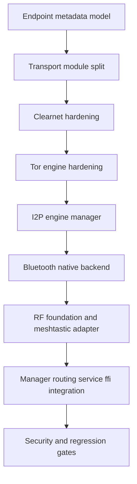
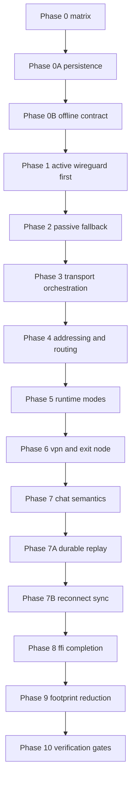

# Mesh Infinity Backend Execution Plan

This plan aligns implementation to `SPEC.md` and `PMWAN_ARCHITECTURE.md` with mandatory requirements:

- WireGuard is the active tunnel path and is attempted first.
- Per-hop forwarding is mandatory for active tunnels.
- Rotating session keys are mandatory.
- Unlinkable relay metadata is mandatory.
- Onion wrapping is optional.
- Durable persistence and offline delivery are mandatory.

## Finalized security addendum (approved)

This addendum is the authoritative interpretation for implementation sequencing and release gating:

1. **Clearnet is never a plaintext message path**
   - Clearnet may be used only as an **underlay** for WireGuard-enveloped traffic.
   - Direct app-payload sends over clearnet are disallowed in routing decisions.
2. **WireGuard-first remains mandatory**
   - Active tunnel attempt occurs before any passive fallback path.
3. **Deniability + PFS become explicit release gates**
   - Build readiness requires adversary-model tests for replay resistance, unlinkability, and key-epoch rotation correctness.
4. **Adverse-environment operations are first-class**
   - Offline spool, reconnect reconciliation, and partition recovery behavior are validated under churn/crash scenarios.
5. **Hosted services are a core capability**
   - Service hosting/publishing must be trust-gated, policy-routed, and privacy-preserving by default.

## Phase 0: Canonical backend completion matrix

Goal: map every backend requirement to owning modules and acceptance tests before implementation edits.

Deliverables:

1. Capability matrix with columns: capability, source section, owner modules, required interfaces, tests, security invariant.
2. Explicit traceability to runtime and FFI surfaces.

Acceptance:

- No backend requirement from SPEC or PMWAN docs is unmapped.
- Every mapped capability has at least one concrete verification path.

Security checkpoint:

- Document global invariants and adversary model assumptions to be checked in each phase.

### Phase 0 deliverable: canonical capability matrix

| Capability | Spec / Arch reference | Owner modules | FFI / runtime surface | Acceptance checks |
|---|---|---|---|---|
| Active WireGuard first over underlays | `SPEC.md` WireGuard-first routing and transport policy; `PMWAN_ARCHITECTURE.md` transport stack | `backend/core/mesh/wireguard.rs`, `backend/transport/manager.rs`, `backend/transport/core_manager.rs` | `backend/ffi/lib.rs` transport toggles and runtime config surfaces | Unit tests for underlay ordering + failover (`transport::manager`, `transport::core_manager`), lib test pass gate |
| Mandatory per-hop forwarding and next-hop-only metadata | `PMWAN_ARCHITECTURE.md` hop-by-hop routing | `backend/core/mesh/routing.rs`, `backend/core/network_stack/hop_router.rs` | Internal service routing orchestration in `backend/service.rs` | Routing security tests: designated-hop enforcement and relay metadata checks |
| Rotating session keys | `SPEC.md` security constraints; phase invariants | `backend/core/mesh/wireguard.rs`, `backend/crypto/pfs.rs` | Runtime service startup path + session management | Rotation epoch tests and key ratchet behavior checks |
| Passive encapsulated fallback | `SPEC.md` fallback requirement | `backend/crypto/message_crypto.rs`, `backend/core/mesh/routing.rs`, `backend/service.rs` | FFI message send paths in `backend/ffi/lib.rs` | Passive fallback test suite (`passive_fallback_*`) |
| Addressing / conversation split (PMWAN) | `PMWAN_ARCHITECTURE.md` 256-bit address format | `backend/core/network_stack/mesh_address.rs` | FFI message + room APIs derive IDs indirectly | Address parse / split / deterministic derivation tests |
| Reachability announcements without full-path leakage | `PMWAN_ARCHITECTURE.md` announcement model | `backend/core/network_stack/hop_router.rs` | Runtime discovery-refresh path | Announcement privacy tests (no next-hop identity leakage), split-horizon tests |
| Transport downgrade resistance and trust-gating | `SPEC.md` anti-downgrade and trust gating | `backend/transport/manager.rs`, `backend/transport/core_manager.rs`, `backend/service.rs` | Runtime flags + FFI transport toggles | Enabled transport order tests and trust-gated path tests |
| Durable chat spool and replay | `SPEC.md` durable/offline requirements | `backend/service.rs`, `backend/core/file_transfer/*` | FFI reconnect / sync APIs in `backend/ffi/lib.rs` | Offline queue boundedness, ack checkpoint, replay rejection tests |
| Reconnect sync (messages + transfers) | `SPEC.md` reconnect recovery requirements | `backend/service.rs`, `backend/core/file_transfer/transfer_manager.rs` | Reconnect FFI endpoints (`sync_room_messages`, resumable transfer endpoints) | Reconnect snapshot and missed-range sync tests |
| VPN + exit node policy routing | `PMWAN_ARCHITECTURE.md` VPN service and exit routing | `backend/core/network_stack/vpn_service.rs`, `backend/core/exit_node/*` | Runtime mode + FFI networking controls | VPN source validation and exit-node trust-policy tests |
| FFI hardening and deterministic errors | `SPEC.md` untrusted UI boundary | `backend/ffi/lib.rs`, `src/runtime.rs` | Full Flutter-facing C ABI | FFI argument validation + stable error mapping tests |

### Phase 0 global invariants (authoritative)

1. Relay visibility is restricted to previous hop + immediate next hop only.
2. Active path attempts WireGuard before passive fallback unless explicitly policy-disabled.
3. Security-critical state transitions are crash-safe and idempotent on restart replay.
4. Reconnect and retry logic is dedupe-safe (no duplicate side effects after ack).
5. Runtime/FFI surfaces never bypass trust-policy and transport downgrade guards.

## Phase 0A: Persistence model and crash recovery contract

Goal: define durable storage contracts and startup recovery behavior before reworking transport and routing flows.

Persistent domains:

1. Identity and key material metadata.
2. Web of trust data and revocations.
3. Reachability and route state snapshots.
4. Session and key-rotation state.
5. Chat spool and delivery ledger.
6. File transfer progress ledger and checkpoints.
7. Transport policy and service configuration.

Durability rules:

- Write-ahead record before mutable state transition.
- Idempotent replay on restart.
- Ordered recovery boot sequence.
- Corruption detection and bounded rollback.

Acceptance:

- Recovery tests prove no acknowledged message or transfer checkpoint is lost after crash.
- Corrupt segment isolation does not corrupt unrelated state domains.

Security checkpoint:

- Persistence never stores relay-linkable metadata that violates unlinkability requirements.

### Phase 0A deliverable: durable persistence schema

| Domain | Canonical owner | Durable records | Primary keys |
|---|---|---|---|
| Identity metadata | `backend/auth/identity.rs`, `backend/auth/storage.rs` | local peer id, public identity profile, revocation markers | `peer_id` |
| Trust graph | `backend/auth/web_of_trust.rs` | trust levels, endorsements, revocation evidence | `(endorser, target)` |
| Route / reachability snapshots | `backend/core/network_stack/hop_router.rs`, `backend/core/mesh/routing.rs` | neighbor set, reachability announcements, route score snapshots | `destination_device_address` |
| Session / rotation state | `backend/core/mesh/wireguard.rs`, `backend/crypto/pfs.rs` | session epoch, key lifetime bounds, prior-epoch references | `(peer_id, epoch)` |
| Message spool / delivery ledger | `backend/service.rs` | queued envelope metadata, retry counters, ack checkpoints, expiry | `(conversation_id, message_id)` |
| File transfer state | `backend/core/file_transfer/transfer_manager.rs` | transfer status, chunk checkpoints, resume tokens, compaction markers | `transfer_id` |
| Transport policy state | `backend/transport/manager.rs`, `backend/transport/core_manager.rs` | transport enable flags, trust gating thresholds, failover policy snapshots | `policy_version` |
| Hosted service config | `backend/service.rs` | service descriptors, bind policy, publish state | `service_id` |

### Phase 0A crash consistency and startup recovery order

1. **Write intent first**: append transition intent record before mutable state change.
2. **Apply + checkpoint**: apply transition and atomically advance domain checkpoint.
3. **Replay on startup** (strict order):
   - identity + trust domains
   - transport/policy domain
   - routing/reachability domain
   - session/rotation domain
   - message spool + ack ledger
   - file transfer checkpoints
   - hosted service config
4. **Corruption handling**:
   - isolate to failing domain segment;
   - preserve last good checkpoint for unrelated domains;
   - mark quarantined segment read-only and continue degraded startup;
   - emit deterministic error surface to FFI/runtime.

### Phase 0A journal strategy

- Logical append-only journal per domain with monotonic sequence id.
- Periodic snapshot + compaction; compaction only after checkpoint barrier advances.
- Replay is idempotent by `(domain, sequence, logical_key)` dedupe keys.

## Phase 0B: Offline delivery contract

Goal: define deterministic behavior when peers are intermittently online.

Contract elements:

1. Enqueue semantics with stable message id and dedupe key.
2. Retry policy with bounded window and expiry.
3. Ordering guarantees per conversation and causal checkpointing.
4. Replay-safe acknowledgements.
5. Reconciliation protocol on reconnect.

State machine:

- queued -> routed -> forwarded -> delivered or expired
- queued -> routed -> failed -> retrying -> routed

Acceptance:

- Duplicate delivery prevented under reconnect storms and retry races.
- Ordering retained for accepted delivery window.

Security checkpoint:

- Offline queue metadata cannot reveal origin beyond prior hop constraints.

### Phase 0B deliverable: deterministic offline contract (`backend/service.rs`)

#### Enqueue contract

1. `message_id`: stable sender-generated identifier.
2. `dedupe_key`: deterministic hash over `(conversation_id, sender_peer, client_nonce, payload_mac)`.
3. `enqueue_at`, `expires_at`, `retry_budget`, and current `state` persisted atomically.

#### Ordering + retry semantics

1. Per-conversation ordering is maintained by monotonic logical sequence.
2. Retry respects bounded backoff and expiry cut-off.
3. Reconciliation is required to resume from `forwarded`/`retrying` states after reconnect.

#### Delivery state machine (authoritative)

- `queued` → `routed` → `forwarded` → `delivered`
- `queued` → `routed` → `failed` → `retrying` → `routed`
- Any non-delivered state → `expired` when `now >= expires_at`

#### Idempotency guarantees

1. Duplicate enqueue with same `dedupe_key` is a no-op update (not a second message).
2. Duplicate replay after ack checkpoint advancement is rejected.
3. Reconnect sync applies missing ranges idempotently via checkpoint cursor semantics.

#### File-transfer continuation semantics

1. Transfer chunk checkpoints are monotonic and durable.
2. Resume token binds transfer id + checkpoint + trust context.
3. Completed or canceled transfers are excluded from resumable set; compaction is safe post-ack.

## Phase 1: Active tunnel restoration and dependency hardening

Goal: restore true active WireGuard-over-underlay behavior and maintain build-health compatibility.

Scope:

1. Rework active tunnel design in backend core mesh wireguard path.
2. Attempt WireGuard first over available underlays.
3. Integrate session key rotation schedule and peer-scoped epoch transitions.
4. Ensure per-hop forwarding wrapper around active tunnel packets.
5. Resolve dependency incompatibility without behavior regression.

Acceptance:

- End-to-end active tunnel establishment succeeds with underlay fallback.
- Relay nodes observe only prior hop and next hop metadata.
- Dependency graph passes compatibility checks and compiles cleanly.

Security checkpoint:

- Verify unlinkability and hop-local observability with adversary probes.

## Phase 2: Passive encapsulated-message fallback

Goal: guarantee passive messaging path when active tunnel cannot be established.

Scope:

1. Use message crypto encapsulation for passive store-forward path.
2. Integrate fallback decision logic with routing outcomes.
3. Preserve dedupe and ordering contracts from Phase 0B.

Acceptance:

- Fallback activates only after active tunnel attempts fail by policy.
- Message integrity and confidentiality are preserved end-to-end.

Security checkpoint:

- Confirm observers cannot attribute sender beyond previous hop.

## Phase 3: Multi-transport orchestration and downgrade resistance

Goal: finalize transport policy engine for Tor, I2P, clearnet, bluetooth, and direct links.

Scope:

1. Unified quality scoring and policy-based transport selection.
2. Trust-gated path selection.
3. Downgrade protection when higher privacy transports are available.
4. Controlled failover with bounded retry storms.

Acceptance:

- Policy outcomes are deterministic for same inputs.
- Failover converges without path oscillation.

Security checkpoint:

- Adversary cannot force persistent downgrade without explicit user policy allowance.
- Clearnet path cannot be selected as direct plaintext transport for message payloads.

## Phase 3A: Internal transport-engine architecture update

Goal: replace daemon-dependent or placeholder transport behavior with in-process transport engines managed by Mesh Infinity runtime.

### Non-negotiable rules

1. Mesh Infinity owns transport session lifecycle in-process.
2. No runtime dependency on external Tor/I2P router daemons for core operation.
3. Clearnet remains underlay-only for WireGuard-enveloped payloads.
4. Unsupported platform capabilities fail closed, never silently downgrade to insecure transport behavior.

### Transport engine model

Every transport module implements a shared internal pattern:

1. `engine`: capability detection, session lifecycle, key/material handling, health state.
2. `dialer`: outbound secure connect path.
3. `listener`: inbound accept path with deterministic close semantics.
4. `connection`: encrypted framed stream adapter with liveness checks.
5. `policy hook`: trust gating + downgrade resistance + quality metrics.

### Required module split

1. `backend/transport/tor.rs`: in-process Tor engine wrapper, not daemon relay dependency.
2. `backend/transport/i2p.rs`: in-process I2P transport manager abstraction with protocol engine ownership in backend.
3. `backend/transport/bluetooth.rs`: native Bluetooth LE or RFCOMM backend with platform capability probing.
4. `backend/transport/clearnet.rs`: hardened TCP underlay adapter for tunnel-carrying traffic only.
5. `backend/transport/rf.rs`: RF backend foundation with feature-gated adapter for Meshtastic integration.

### Transport endpoint metadata contract

`PeerInfo` must expose transport-specific endpoint metadata map keyed by transport type for non-TCP transports.

Minimum endpoint payloads:

1. Tor: onion service address and port metadata.
2. I2P: destination and tunnel/session metadata.
3. Bluetooth: device address, service UUID, channel characteristics.
4. RF: node id, region profile, modulation profile, channel id.
5. Clearnet: socket endpoint as fallback underlay metadata.

### Tor engine requirements

1. Runtime-owned bootstrap and circuit manager with deterministic retries.
2. Onion-service listener lifecycle owned in-process.
3. Connection framing + cancellation-safe close path.
4. Health telemetry surfaced to transport manager quality scoring.

### I2P engine requirements

1. Backend-owned I2P session manager and stream multiplexer abstraction.
2. Backend-owned tunnel lifecycle and destination publication contract.
3. Inbound accept queue with bounded memory and replay-safe handshake behavior.
4. Deterministic error mapping for session, tunnel, and stream failures.

### Bluetooth engine requirements

1. Platform capability probe at startup and on adapter state changes.
2. Secure pairing policy integration with trust levels.
3. MTU-aware framed transport with backpressure handling.
4. Mandatory encryption and authenticated peer identity binding before payload exchange.

### RF plus Meshtastic adapter requirements

1. Add `TransportType::Rf` and feature-gated Meshtastic adapter module.
2. Adapter maps mesh envelopes to RF frames with strict size and retry policy.
3. RF path must preserve relay metadata minimization constraints.
4. RF enablement is explicit policy action and never implicit fallback.

### Manager and routing integration changes

1. `backend/transport/manager.rs`: register and gate new transport modules and transport capabilities.
2. `backend/transport/core_manager.rs`: scoring and failover logic extended for endpoint metadata availability and engine health.
3. `backend/core/mesh/routing.rs`: enforce anti-downgrade order including RF and transport capability readiness.
4. `backend/service.rs` and `backend/ffi/lib.rs`: expose transport capability status and endpoint-policy configuration.

### Verification gates for Phase 3A

1. Unit tests per transport engine for connect, listen, close, capability probe, and error mapping.
2. Anti-downgrade tests with mixed availability states across Tor, I2P, Bluetooth, RF, and clearnet.
3. Property tests for endpoint metadata parser and validation.
4. Security tests for fail-closed behavior when capability or endpoint metadata is missing.
5. Integration tests proving no plaintext app payload path over clearnet.

### Execution order for implementation mode

1. Model update: endpoint metadata + transport enum extensions.
2. Module split completion and old `basic.rs` retirement.
3. Clearnet hardening pass.
4. Tor engine hardening pass.
5. I2P engine manager implementation pass.
6. Bluetooth native backend implementation pass.
7. RF foundation plus Meshtastic feature-gated adapter.
8. Manager, routing, service, and FFI convergence.
9. Full gate run.

## Phase 4: PMWAN addressing and hop routing completion

Goal: complete addressing, announcements, and route computation consistency.

Scope:

1. Mesh address format and conversation id alignment.
2. Reachability announcements and route table updates.
3. Hop forwarding behavior for active and passive paths.

Acceptance:

- Route computation stable under churn and partial partition.
- Announcement processing converges to consistent next-hop state.

Security checkpoint:

- Announcement and route metadata do not reveal full path topology to non-neighbors.

## Phase 5: Server and dual-mode orchestration

Goal: stabilize runtime lifecycle across client, server, and dual roles.

Scope:

1. Deterministic mode transition lifecycle.
2. Service loop ownership and shutdown correctness.
3. Role-specific policy overlays.

Acceptance:

- Role changes do not leak tasks, channels, or stale route state.

Security checkpoint:

- Role transitions cannot bypass trust or route policy checks.

## Phase 6: VPN and exit-node completion

Goal: complete on-device routing pipeline and exit-node policy integration.

Scope:

1. Virtual interface packet flow and policy router integration.
2. Exit-node selection and trust controls.
3. Transport-aware route steering.

Acceptance:

- Packet forwarding obeys selected policy and trust constraints.
- Exit routing correctly isolates non-mesh traffic when configured.

Security checkpoint:

- Spoofing prevention and route-policy constraints enforced under adversarial packet injection.

## Phase 6A: Hosted services architecture and secure publication

Goal: make mesh-hosted services production-grade while preserving deniability, trust policy, and adverse-environment resilience.

Scope:

1. Service descriptor model with trust-gated publish permissions.
2. Ingress policy checks (peer trust, transport policy, exit/relay constraints).
3. Service discovery publication over mesh with minimum metadata exposure.
4. Offline-aware service request handling semantics where applicable.

Acceptance:

- Hosted service registration and publication are deterministic and policy-audited.
- Unauthorized or policy-disallowed service ingress is rejected with deterministic error codes.

Security checkpoint:

- Service publication and routing metadata reveal only required next-hop context.
- No hosted-service path bypasses trust, transport, or downgrade protections.

## Phase 7: Chat domain semantics over network primitives

Goal: finalize room and message semantics using completed network stack.

Scope:

1. Message lifecycle and event consistency.
2. Peer presence and room synchronization.
3. Delivery status accuracy across reconnect cycles.

Acceptance:

- Chat state remains convergent across peers after partitions heal.

Security checkpoint:

- Chat metadata exposure is limited to required routing context only.

## Phase 7A: Durable spool and replay

Goal: production-grade durable replay with bounded storage.

Scope:

1. Ack checkpoints and replay cursor model.
2. Compaction and retention policy.
3. Idempotent apply on duplicate replay blocks.

Acceptance:

- Replay recovers all ack-eligible messages after crash.
- Compaction never removes data required for active recovery windows.

Security checkpoint:

- Compaction artifacts do not create sender-linkability side channels.

## Phase 7B: Reconnect sync for messages and transfers

Goal: complete peer reconciliation protocol for missed data and interrupted transfers.

Scope:

1. Missing-range exchange protocol.
2. Resume token and chunk checkpoint integrity.
3. Conflict resolution rules under concurrent resume attempts.

Acceptance:

- Reconnect sync converges deterministically without duplicate side effects.

Security checkpoint:

- Sync negotiation exposes only minimum state required to reconcile.

## Phase 8: FFI surface hardening and completion

Goal: expose all required backend capabilities to Flutter through strict and safe FFI APIs.

Scope:

1. Capability parity audit.
2. Error mapping consistency.
3. Memory and lifecycle safety checks.

Acceptance:

- No backend feature required by spec is unreachable through FFI.
- FFI error paths are stable and deterministic.

Security checkpoint:

- FFI boundary cannot bypass backend trust, routing, or policy guards.

## Phase 9: Footprint reduction and module consolidation

Goal: reduce maintenance surface while preserving behavior and spec compliance.

Scope:

1. Remove dead or duplicate modules.
2. Consolidate overlapping abstractions.
3. Replace large bespoke logic with maintained crates when warranted.

Acceptance:

- Reduced module count and lower maintenance overhead with no capability loss.

Security checkpoint:

- Refactors preserve all previously defined invariants and adversary test outcomes.

## Phase 10: Verification and readiness gates

Goal: enforce objective release gates for stability, security, and correctness.

Required gates:

1. Formatting and compile gates.
2. Integration and conformance suites.
3. Durability and crash-recovery tests.
4. Fault-injection and adversary-model tests.
5. Compatibility and future-incompatible dependency checks.
6. Deniability and forward-secrecy adversary suite.
7. Hosted-services security conformance suite.

Acceptance:

- All gates pass on canonical build path.
- Reports include traceability to Phase 0 matrix rows.

### Additional mandatory gate definitions

1. **Deniability/PFS gate**
   - Verify no persistent sender-linkable metadata beyond previous-hop context.
   - Verify key rotation and epoch transitions invalidate stale replay material.
2. **Clearnet-underlay gate**
   - Verify direct clearnet app-payload routing is rejected.
   - Verify clearnet remains available only as WireGuard-enveloped fallback underlay.
3. **Adverse-environment gate**
   - Validate recovery under delayed delivery, reconnect storms, and crash/restart replay.
4. **Hosted-services gate**
   - Validate trust-gated publish, ingress policy enforcement, and deterministic denial behavior.

### Current gate run snapshot

Latest backend verification run status:

1. Formatting gate: `cargo fmt --all -- --check` initially reported style deltas; normalized with `cargo fmt --all`.
2. Compile gate: `cargo check --all-targets` passed after normalization.
3. Targeted reconnect/FFI validations: `cargo test --lib reconnect_sync -- --nocapture`, `cargo test --lib mdns -- --nocapture`, and repeated full `cargo test --lib -- --nocapture` all passed.
4. Full test gate: `cargo test --lib -- --nocapture` passed with 90 tests green.
5. Lint gate: `cargo clippy --all-targets` now completes successfully; remaining findings are warnings (non-blocking) tracked for iterative cleanup.

### Phase 9 consolidation snapshot

Recent consolidation/hardening completed while preserving behavior:

1. Service-level transfer API consolidation:
   - Added direct lookup (`file_transfer`) to avoid scanning full transfer lists for single-ID status checks.
   - Added explicit transfer-compaction API (`compact_file_transfers`) to mirror passive-state compaction patterns.
2. Room validation deduplication:
   - Centralized repeated room-existence checks through a shared helper and reused it across select/send/sync/delete flows.
3. FFI parity and consistency improvements:
   - Added reconnect/offline delivery endpoints (`sync_room_messages`, resumable transfers, reconnect snapshot, passive ack checkpoint, passive-state compaction, transfer compaction).
   - Standardized several error paths to centralized error-code mapping.
   - Reduced duplicated transfer-status lookup logic by using service-native single-transfer query.
   - Harmonized mDNS FFI access paths through shared service-lock helpers.

## Security invariants to hold in all phases

1. Previous-hop only observability at relay nodes.
2. Per-hop forwarding for active tunnel traffic.
3. Session key rotation with bounded key lifetime.
4. Unlinkable relay metadata across hops and epochs.
5. Optional onion wrapping never weakens mandatory protections.

## Adversary model checkpoints template

Each phase includes explicit tests against:

1. Honest-but-curious relay observation.
2. Multi-hop traffic correlation attempts.
3. Transport downgrade pressure.
4. Replay and duplication attacks.
5. Crash and restart during in-flight delivery.

## Execution flow

